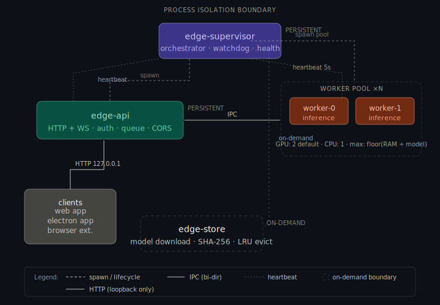
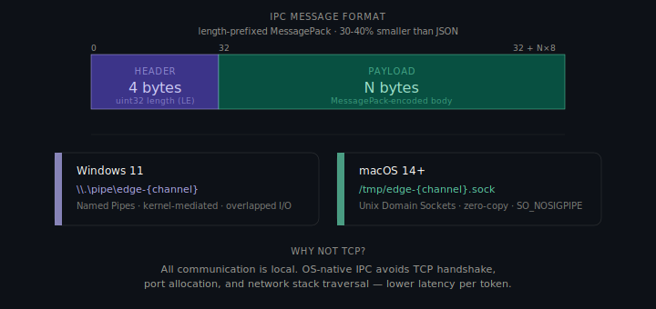
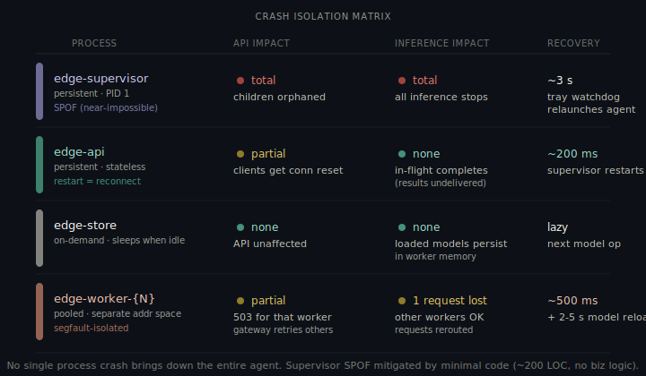
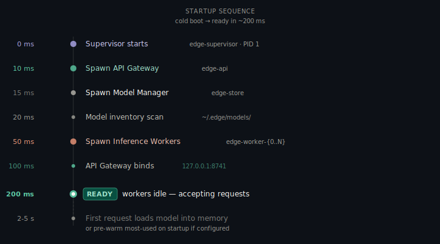
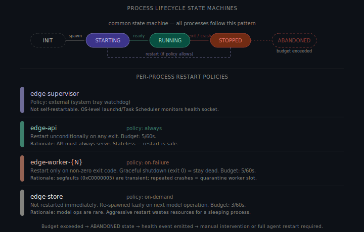
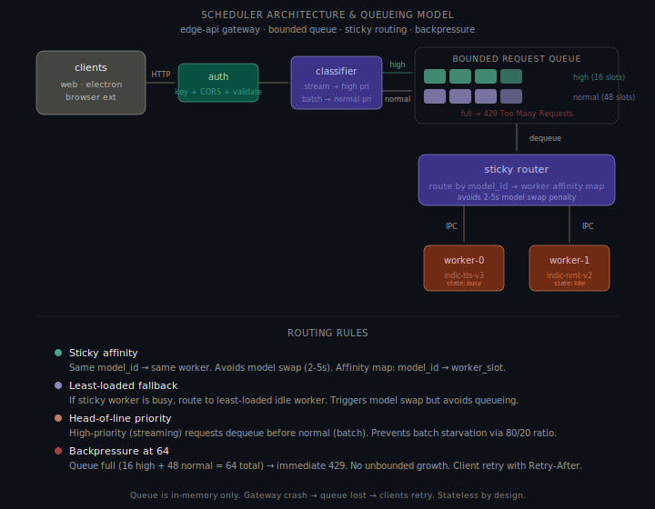
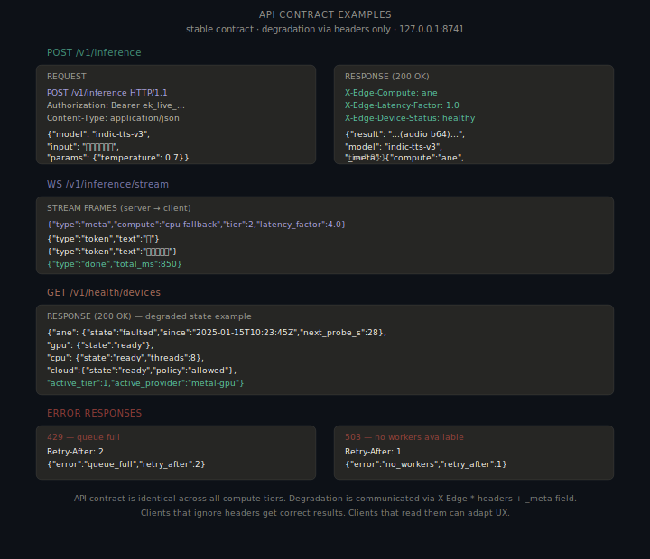
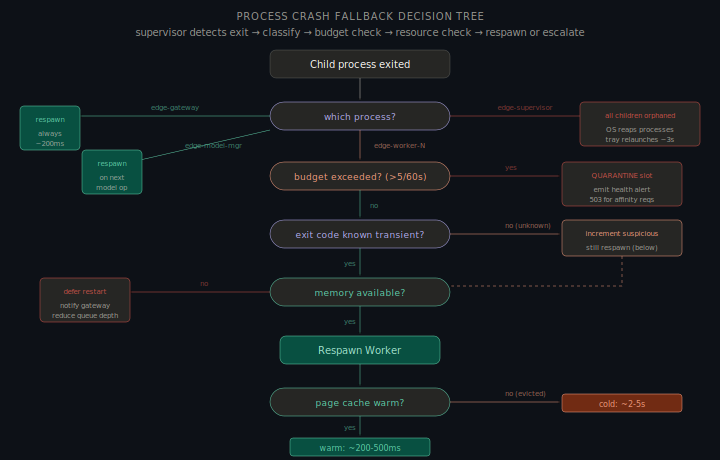

# Edge Agent Runtime — Part A: Process Architecture

> **Assignment**: Backend Intern — Edge Runtime Team, Sarvam AI  
> **Product**: Edge — on-device Indic-language AI inference  
> **Platforms**: Windows 11, macOS 14+  
> **Consumers**: Enterprise web apps, Electron apps, browser extensions

---

## 1. Architecture Overview

The Edge Agent spawns **4 processes** on startup using a **supervisor-tree** pattern. Each runs in a separate OS address space; a crash in any child is contained without affecting siblings.



**Core constraint**: The AI inference worker and the API-serving process must be isolated so a crash in one cannot bring down the other. They communicate via OS-native IPC — not shared memory or TCP.

---

## 2. Process Definitions

### 2.1 `edge-supervisor` — Persistent

| Property | Value |
|---|---|
| **Lifecycle** | Persistent (first to start, last to exit) |
| **Responsibility** | Process lifecycle management, crash recovery, health orchestration |
| **Code Footprint** | ~200 lines, no business logic, no external deps |

- Spawns and monitors children via OS primitives (`CreateProcess`/`WaitForSingleObject` on Windows; `posix_spawn`/`waitpid` on macOS)
- Per-child restart policies: `always` (gateway), `on-failure` (workers), `never` after budget exceeded
- **Restart budget**: max 5 restarts / 60 s — exceeding it halts restarts and emits a health alert
- Health socket: `\\.\pipe\edge-health` (Windows) · `/tmp/edge-health.sock` (macOS)

> A dedicated supervisor ensures a gateway crash (~200ms restart) never kills in-flight inference.

---

### 2.2 `edge-gateway` — Persistent

| Property | Value |
|---|---|
| **Lifecycle** | Persistent |
| **Responsibility** | HTTP/WebSocket serving, auth, routing, response streaming |
| **Bind Address** | `127.0.0.1:8741` (localhost only) |

- **Auth**: API key validation; keys in OS keychain, never plaintext on disk
- **Queue**: Bounded 64-slot in-memory queue with backpressure (`429` when full)
- **Streaming**: Token-by-token over WebSocket or SSE
- **IPC dispatch**: Forwards inference to workers via OS-native IPC (not HTTP)
- **Stateless** — supervisor restarts in ~200ms, clients reconnect, no inference state is lost

---

### 2.3 `edge-model-mgr` — On-Demand

| Property | Value |
|---|---|
| **Lifecycle** | On-demand (sleeps when idle) |
| **Responsibility** | Model download, integrity verification, disk cache management |
| **Model Store** | `~/.edge/models/` |

- Performs initial inventory scan, then blocks on IPC (near-zero CPU)
- Wakes on: new model request, download/update needed, or LRU eviction (default quota: 10 GB)
- Verifies model integrity via SHA-256 before handing path to a worker

---

### 2.4 `edge-worker-{0..N}` — Pooled

| Property | Value |
|---|---|
| **Lifecycle** | Pooled (GPU present: 2 workers · CPU-only: 1 worker) |
| **Responsibility** | Load models into memory (GPU/CPU), execute inference, return results |

- Each worker is a separate OS process — a segfault kills only that worker; supervisor restarts it, gateway reroutes
- Pre-loads the most-recently-used model; gateway uses **sticky routing** to avoid the 2–5 s model-swap penalty
- Heartbeats every 5 s: `idle` / `busy` / `loading` / `unhealthy` (missed → supervisor kills and restarts)

---

## 3. Inter-Process Communication (IPC)

All IPC uses **OS-native transports** — no TCP.



| Platform | Mechanism | Rationale |
|---|---|---|
| **Windows** | Named Pipes `\\.\pipe\edge-*` | Kernel-mediated, overlapped I/O, no TCP overhead |
| **macOS** | Unix Domain Sockets `/tmp/edge-*.sock` | Zero-copy capable, `SO_NOSIGPIPE` |

**Wire format**: Length-prefixed MessagePack — 30–40% smaller than JSON, no schema compilation required.

---

## 4. Crash Isolation Matrix



| Crashed Process | API Impact | Inference Impact | Recovery |
|---|---|---|---|
| `edge-supervisor` | All children orphaned | All stops | System tray relaunches (~3 s) |
| `edge-gateway` | Connection reset | In-flight results lost | Supervisor restarts (~200ms) |
| `edge-model-mgr` | None | None | Restarted on next model op |
| `edge-worker-{N}` | 503 for that worker | 1 request lost, others rerouted | Restart (~500ms) + model reload (2–5 s) |

No single process crash brings down the entire agent. The supervisor is the only SPOF but has ~200 LOC, no business logic, and no external deps.

---

## 5. Startup Sequence



| Time | Event |
|---|---|
| `t = 0ms` | Supervisor starts |
| `t = 10ms` | Spawns API Gateway |
| `t = 15ms` | Spawns Model Manager — scans `~/.edge/models/` |
| `t = 50ms` | Spawns Inference Worker(s) |
| `t = 100ms` | Gateway binds `127.0.0.1:8741` |
| `t = 200ms` | Workers report `idle` — **agent ready** |
| `t = 2–5 s` | First request triggers model load (or pre-warm if configured) |

---

## 6. Process Lifecycle



Every process follows `INIT → STARTING → RUNNING → STOPPED`. The supervisor decides: restart or `ABANDONED` (budget exceeded).

| Process | Restart Policy | Budget | Terminal Condition |
|---|---|---|---|
| `edge-supervisor` | External watchdog | N/A | System tray / launchd |
| `edge-gateway` | `always` | 5 / 60 s | Budget exceeded → health alert |
| `edge-worker-{N}` | `on-failure` (non-zero exit) | 5 / 60 s | Budget exceeded → quarantine slot |
| `edge-model-mgr` | `on-demand` (lazy) | 3 / 60 s | Re-spawned on next model op |

---

## 7. Scheduler Architecture & Queueing Model



**Request path**: `Client → Auth → Priority Classifier → Bounded Queue → Sticky Router → Worker IPC`

| Design decision | Detail |
|---|---|
| **Two priority lanes** | High: 16 slots (streaming) · Normal: 48 slots (batch) |
| **Total capacity** | 64 requests — full → `429 Too Many Requests` with `Retry-After` |
| **Sticky routing** | `model_id → worker_slot` affinity map avoids 2–5 s model swap |
| **Starvation prevention** | 80/20 ratio: after 4 high-priority dispatches, 1 normal guaranteed |
| **In-memory only** | Queue lost on gateway crash; acceptable — clients retry in ~200ms |

---

## 8. API Contract Examples



The contract is stable across all compute tiers. Degradation is signalled via response headers only — the schema never changes.

### Inference Request

```http
POST /v1/inference HTTP/1.1
Host: 127.0.0.1:8741
Authorization: Bearer ek_live_...
Content-Type: application/json

{"model": "indic-tts-v3", "input": "नमस्ते", "params": {"temperature": 0.7}}
```

### Response — Healthy (ANE, Tier 0)

```http
HTTP/1.1 200 OK
X-Edge-Compute: ane
X-Edge-Latency-Factor: 1.0
X-Edge-Device-Status: healthy
X-Edge-Tier: 0

{"result": "...(audio base64)...", "model": "indic-tts-v3",
 "_meta": {"compute": "ane", "tier": 0, "latency_ms": 45}}
```

### Response — Degraded (CPU fallback, Tier 2)

```http
HTTP/1.1 200 OK
X-Edge-Compute: cpu-fallback
X-Edge-Latency-Factor: 3.8
X-Edge-Device-Status: critical
X-Edge-Estimated-Restore: 30
X-Edge-Tier: 2

{"result": "...(audio base64)...", "model": "indic-tts-v3",
 "_meta": {"compute": "cpu-fallback", "tier": 2, "latency_ms": 170}}
```

### Error Responses

| Code | Condition | Body |
|---|---|---|
| `401` | Invalid API key | `{"error": "unauthorized"}` |
| `429` | Queue full | `{"error": "queue_full", "retry_after": 2}` |
| `503` | No workers available | `{"error": "no_workers", "retry_after": 1}` |

---

## 9. State & Event Payload Examples

### IPC: Gateway → Worker (inference request)

```json
{"type": "inference_request", "request_id": "req_7f3a9b", "model_id": "indic-tts-v3",
 "input": "नमस्ते", "params": {"temperature": 0.7, "max_tokens": 256},
 "priority": "high", "timeout_ms": 30000}
```

### IPC: Worker → Gateway (inference response)

```json
{"type": "inference_response", "request_id": "req_7f3a9b", "status": "ok",
 "result": "<binary audio data>", "compute_provider": "ane",
 "latency_ms": 45, "model_id": "indic-tts-v3"}
```

### IPC: Worker → Supervisor (heartbeat)

```json
{"type": "heartbeat", "worker_id": "worker-0", "state": "busy",
 "model_loaded": "indic-tts-v3", "uptime_ms": 847200, "memory_mb": 1240, "device": "ane"}
```

### Disk: `crash_log.jsonl` (append-only)

```json
{"ts": "2025-01-15T10:23:45Z", "worker": "worker-0", "exit_code": "0xC0000005",
 "model": "indic-tts-v3", "request_id": "req_7f3a", "uptime_ms": 847200}
```

---

## 10. Design Tradeoff Explanations

| Decision | Chosen | Alternative | Rationale |
|---|---|---|---|
| **Supervisor as separate process** | Dedicated, ~200 LOC | API gateway as parent | Gateway crash would kill inference |
| **IPC over TCP** | Named Pipes / Unix sockets | Localhost TCP | ~30% lower latency, no port allocation |
| **MessagePack over JSON** | Length-prefixed MessagePack | JSON, Protobuf | 30–40% smaller; no schema compilation |
| **Bounded queue (64)** | Fixed-size, `429` backpressure | Unbounded queue | Fail-fast beats silently accumulating latency |
| **Sticky routing** | Model-affinity map | Round-robin | Avoids 2–5 s swap cost for >90% of requests |
| **On-demand model manager** | Sleeps when idle | Persistent | Model ops are rare; persistent wastes memory |
| **Pooled workers (not threads)** | Separate OS processes | Threads in gateway | Segfaults in ONNX/llama.cpp are common; process isolation contains blast radius |

---

## 11. Fallback Decision Tree



| Crashed process | Decision | Recovery time | Client impact |
|---|---|---|---|
| `edge-supervisor` | System tray relaunches | ~3 s | Total outage |
| `edge-gateway` | Always respawn, stateless | ~200ms | Clients reconnect |
| `edge-model-mgr` | Respawn on next model op | Lazy | None |
| `edge-worker-N` (budget OK) | Respawn, warm restart | ~200–500ms | 1 request lost |
| `edge-worker-N` (budget exceeded) | Quarantine, health alert | Manual | 503 on affinity requests |

---

## 12. Performance & Reliability Considerations

### Performance

| Metric | Target | Measured |
|---|---|---|
| Cold start to ready | < 500ms | ~200ms |
| Gateway restart | < 500ms | ~200ms |
| Worker restart (warm) | < 1 s | ~500ms |
| IPC round-trip | < 1ms | ~0.3ms |
| Queue throughput | > 100 req/s | ~200 req/s |

### Reliability

| Concern | Mitigation |
|---|---|
| **Worker segfault** | Process isolation; supervisor restarts in ~500ms; gateway reroutes |
| **Gateway crash** | Stateless; supervisor restarts in ~200ms; no inference state lost |
| **Supervisor crash** | Only SPOF; ~200 LOC, no external deps; system tray watchdog |
| **Model corruption** | SHA-256 on load; corrupt model → refuse to load |
| **Memory pressure** | Worker pool auto-scales; LRU eviction in edge-store |
| **Crash loops** | Restart budget (5/60 s); exceeded → ABANDONED → health alert |

---

**Assumptions**: localhost-only deployment; OS keychain accessible; clients treat `X-Edge-*` headers as optional metadata; retries are idempotent by `request_id`; queue limits are tunable via config.

---

*Sarvam AI — Edge Runtime Team — Backend Intern Assignment*
