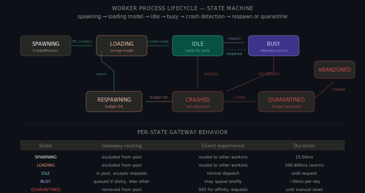
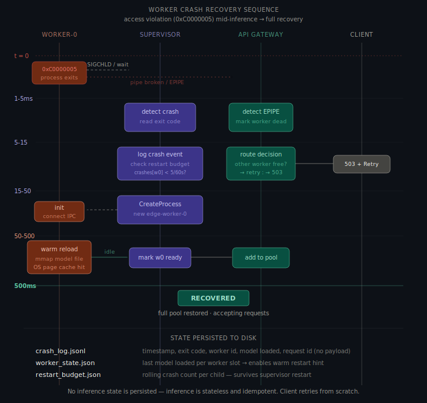
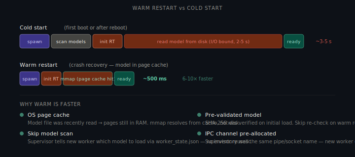

# Edge Agent Runtime — Part A §2: Worker Crash Recovery

> **Scenario**: `edge-worker-0` crashes mid-inference due to a Windows access violation (`0xC0000005`). A client request is in-flight.

---

## Architecture Context

Three components participate in recovery:

- **`edge-supervisor`** — monitors child PIDs via `WaitForSingleObject` / `waitpid`. Owns crash detection, budget enforcement, and respawn.
- **`edge-gateway`** — stateless API server on `127.0.0.1:8741`. Detects broken pipes on worker crash; re-routes or returns 503.
- **`edge-worker-N`** — inference worker. Single model loaded at a time. IPC via Named Pipes (Windows) / Unix Domain Sockets (macOS) with MessagePack encoding.

**Assumptions**: OS page cache retains model data after process exit (warm restart path). Client retries are idempotent by `request_id`. Restart budget is persisted to disk to survive supervisor restarts. Model files in `~/.edge/models/` are immutable once deployed. Inference is stateless — no partial results or checkpoints.

---

## 1. Worker Process Lifecycle



| State | Description | Gateway routing | Duration |
|---|---|---|---|
| **SPAWNING** | Process created, waiting for IPC connect | Excluded from pool | 15–50ms |
| **LOADING** | IPC connected, loading model via `mmap` | Excluded from pool | 100–400ms (warm) / 2–5s (cold) |
| **IDLE** | Model loaded, heartbeat `idle` | In pool | Until request |
| **BUSY** | Inference in progress | In pool, queued if sticky | ~50ms/request |
| **CRASHED** | Exit detected by supervisor | Removed from pool, in-flight fails | ~1–5ms detection |
| **RESPAWNING** | Budget passed, new process spawning | Excluded | 15–50ms |
| **QUARANTINED** | Budget exceeded (>5 crashes / 60s) | Removed, 503 for affinity requests | Until manual reset |

---

## 2. Recovery Sequence (0 → 500ms)



### t = 0ms — Crash

`0xC0000005` (ACCESS_VIOLATION) terminates the worker immediately. Two simultaneous events:

1. **Supervisor** — `WaitForSingleObject` / `waitpid` unblocks with exit code. Kernel-mediated, ~1ms.
2. **Gateway** — next `WriteFile` / `write` on the IPC channel returns `ERROR_BROKEN_PIPE` / `EPIPE`. Detected in same event loop tick, ~1–3ms.

### t = 1–5ms — Detection

Supervisor reads exit code:
```
GetExitCodeProcess(worker0_handle, &exit_code)  // exit_code = 0xC0000005
```
Gateway marks `worker-0` dead in routing table. The in-flight request is unresolvable.

### t = 5–15ms — Decision

**Supervisor** — three sequential checks:

| Check | Question | Failure action |
|---|---|---|
| Restart budget | < 5 crashes in last 60s? | Don't restart; emit health alert; log to `crash_log.jsonl` |
| Exit code | Known transient? | Still restart; increment "suspicious" counter |
| Resources | Enough free memory? | Defer restart; notify gateway to reduce queue depth |

**Gateway** — routing decision for the in-flight request:

| Pool state | Action |
|---|---|
| Another worker idle with same model | Re-dispatch transparently (~50ms extra) |
| Another worker with different model | Re-dispatch (triggers model swap, 2–5s extra) |
| No workers | Return `503 Service Unavailable` + `Retry-After: 1` |

The gateway does not buffer the request payload — it's <1KB and the client already has it.

### t = 15–50ms — Respawn

Supervisor calls `CreateProcess` / `posix_spawn`. New `edge-worker-0`:
- Re-uses the pre-existing IPC channel name (`\\.\pipe\edge-worker-0`) — no new pipe creation
- Receives warm restart hint from supervisor: load `indic-tts-v3` directly

### t = 50–500ms — Warm Model Reload



The previous worker had the model mapped seconds ago — the OS page cache retains it. New worker's `mmap` / `MapViewOfFile` resolves entirely from RAM.

| Operation | Cold start | Warm restart |
|---|---|---|
| Model file I/O | 2–5s (disk) | ~100ms (page cache) |
| SHA-256 verify | ~200ms | Skipped (verified on first load) |
| Model scan | ~20ms | Skipped (hint from supervisor) |
| Runtime init | ~50ms | ~50ms |
| IPC connect | ~5ms | ~2ms (pipe exists) |
| **Total** | **2–5s** | **~200–500ms** |

At ~500ms: new worker sends `idle` heartbeat; gateway restores it to the routing pool.

---

## 3. Client-Visible Response During Crash

| Pool state | HTTP response | Client experience |
|---|---|---|
| Other worker, same model | `200 OK` + `X-Edge-Worker-Recovered: true` | ~50ms extra, no error |
| Other worker, different model | `200 OK` + `X-Edge-Worker-Recovered: true` | ~2–5s extra, no error |
| No workers | `503` + `Retry-After: 1` | Retry; warm restart completes in ~500ms |

### Case 1 — Transparent re-route

```http
HTTP/1.1 200 OK
X-Edge-Compute: ane
X-Edge-Worker-Recovered: true
X-Edge-Tier: 0

{"result": "...", "_meta": {"compute": "ane", "tier": 0, "retry_count": 1}}
```

### Case 2 — 503 (no workers)

```http
HTTP/1.1 503 Service Unavailable
Retry-After: 1

{"error": "no_workers", "retry_after": 1, "reason": "worker_crash_recovery"}
```

---

## 4. State Persisted to Disk

Inference is stateless — no partial results or checkpoints. Three files are updated:

**`~/.edge/logs/crash_log.jsonl`** — append-only, one line per crash:
```json
{"ts":"2025-01-15T10:23:45.123Z","worker":"worker-0","exit_code":"0xC0000005","model":"indic-tts-v3","request_id":"req_7f3a","uptime_ms":847200}
```

**`~/.edge/state/worker_state.json`** — last-loaded model per worker (warm restart hint):
```json
{"worker-0": {"model": "indic-tts-v3", "loaded_at": "2025-01-15T10:00:00Z"}}
```

**`~/.edge/state/restart_budget.json`** — rolling crash counter; survives supervisor restarts:
```json
{"worker-0": {"crashes": [1736934225123], "budget": 5, "window_ms": 60000}}
```

---

## 5. Scheduler Behavior During Recovery

1. **Remove dead worker** from routing table — sticky affinity map entry for `worker-0` deleted
2. **Drain in-flight queue entries** for that worker — re-assign to next available or return 503
3. **Reduce capacity threshold** proportionally (e.g., 64 → 32 with 1 of 2 workers down)
4. **Re-register on recovery** — first `idle` heartbeat restores normal threshold

---

## 6. IPC State/Event Payloads

**Supervisor → Gateway (worker death):**
```json
{"type": "worker_status", "worker_id": "worker-0", "state": "dead",
 "exit_code": "0xC0000005", "timestamp": "2025-01-15T10:23:45.123Z"}
```

**Supervisor → Gateway (recovery complete):**
```json
{"type": "worker_status", "worker_id": "worker-0", "state": "idle",
 "model_loaded": "indic-tts-v3", "warm_restart": true, "restart_duration_ms": 480}
```

---

## 7. Design Tradeoffs

| Decision | Chosen | Alternative | Rationale |
|---|---|---|---|
| No request replay from disk | Requests not persisted | WAL-style request log | Payload <1KB; client has it; disk I/O on hot path for a rare event |
| Warm restart via page cache | Rely on OS page cache | Custom shared memory region | OS page cache is free — no code needed; shared memory adds IPC surface |
| `worker_state.json` on disk | Persist last-loaded model | IPC-only hint from supervisor | Survives supervisor restart too; file <1KB, written infrequently |
| Fixed restart budget (5/60s) | Fixed | Adaptive crash-pattern budget | Predictable; adaptive adds state machine complexity for marginal benefit |
| No partial result recovery | Lost request, client retries | Checkpoint inference mid-request | Inference stateless and fast (~50ms); checkpointing penalizes every request |

---

## 8. Platform-Specific Detection & Cascading Crash Handling

| Platform | Primitive | Detection window |
|---|---|---|
| Windows 11 | `WaitForSingleObject` + `GetExitCodeProcess` | ~1–5ms — treat `0xC0000005` / `0xC0000409` as non-recoverable |
| macOS 14+ | `waitpid(pid, &status, 0)` | ~1–5ms — distinguish `SIGKILL` (external) from `SIGSEGV` (runtime fault) |

**Cascading crash policy** (replacement worker crashes during recovery):
- Same slot budget counter incremented
- Exponential spawn delay: 50ms → 100ms → 250ms → 500ms → 1000ms cap
- Siblings continue serving at reduced capacity
- Budget exceeded → slot `quarantined`, deterministic `503 no_workers_for_slot`

---

## 9. Request Deduplication

Gateway deduplicates by `request_id` to preserve at-most-once semantics:

| Request state | Behaviour |
|---|---|
| First arrival | Creates in-flight record |
| Retry while in-flight | Returns current state (`queued` / `running`), no re-execution |
| Retry after completion | Returns cached terminal metadata for 30s TTL |
| Retry after error | Returns same error payload until TTL expiry |

State payload example:
```json
{"request_id": "req_7f3a9b", "state": "running", "worker_slot": "worker-1",
 "retry_count": 1, "deduplicated": true}
```

---

## 10. Performance & Reliability

### Metrics

| Metric | Value |
|---|---|
| Crash detection latency | ~1–5ms |
| Gateway re-routing decision | ~5–15ms |
| Worker respawn | ~15–50ms |
| Warm model reload | ~100–400ms |
| **Total recovery time** | **~200–500ms** (vs 3–5s cold) |
| Requests lost per crash | 1 (the in-flight request) |
| Max crash rate before abandon | 5 / 60s per worker |

### Reliability Guarantees

| Concern | Guarantee |
|---|---|
| No cascading failure | Worker crash doesn't affect gateway or other workers |
| At-most-once delivery | Crashed request lost, not duplicated |
| Bounded recovery | Warm restart 6–10× faster than cold, capped ~500ms |
| No data corruption | Inference stateless; no mutable state shared between workers |

---

*Sarvam AI — Edge Runtime Team — Backend Intern Assignment*
