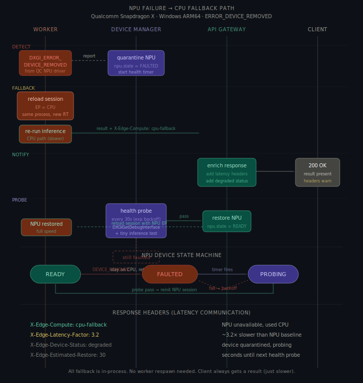
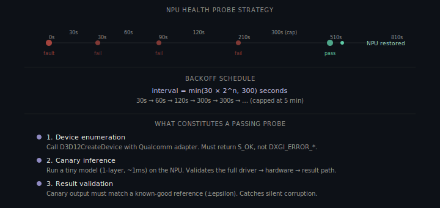

# Part A §3 — Qualcomm NPU Failure Handling (Windows ARM64)

> **Scenario**: On a Snapdragon X Elite system, the Qualcomm NPU driver returns `ERROR_DEVICE_REMOVED` (`DXGI_ERROR_DEVICE_REMOVED`) during inference. This error is unrecoverable for the current session — the NPU device object is invalidated and cannot be reused.

### Architecture Context

This document covers in-process NPU failure handling within `edge-worker-N`:

- **`edge-supervisor`** — receives device state change notifications via IPC. Does not intervene in device fallback — handled entirely in-process.
- **`edge-gateway`** — routes requests to workers. Reads `device` field from worker heartbeats to adjust throughput expectations. The worker stays in the routing pool during NPU fallback (unlike a crash).
- **`edge-worker-N`** — contains an in-process Device Manager that owns the NPU → CPU fallback logic. The worker process stays alive throughout.

### Assumptions

1. **ONNX Runtime supports runtime EP swapping.** The worker can tear down a QNN (NPU) EP session and create a CPU EP session within the same process, without restarting.
2. **`ERROR_DEVICE_REMOVED` is unrecoverable for the current session.** Once the DirectML/QNN device object is invalidated, no API call can restore it.
3. **The NPU driver may recover after a system-level reset** (e.g., Windows driver recovery, sleep/wake cycle). The health probe tests for this.
4. **CPU fallback is always available.** The CPU EP does not require special hardware and cannot return `DEVICE_REMOVED`.
5. **Quarantine state is intentionally in-memory only.** Re-detection after a worker restart costs one failed request (~200ms) — acceptable vs disk persistence complexity.

---

## Overview

This is **not a process crash** — the worker process stays alive. Recovery is entirely in-process: tear down the NPU ONNX Runtime session, rebuild with a CPU EP, retry the request, and quarantine the NPU until a health probe passes. The client always gets a result, just slower.



### Recovery Timeline

| Time | Event | Component | Client impact |
|---|---|---|---|
| `t=0ms` | Inference call returns `DXGI_ERROR_DEVICE_REMOVED` | Worker (ONNX Runtime) | Request in progress |
| `t=1ms` | Device Manager catches HRESULT, marks NPU as `FAULTED` | Worker (Device Manager) | None yet |
| `t=2ms` | NPU ONNX Runtime session destroyed (`reset()`) | Worker | None |
| `t=5–20ms` | CPU ONNX Runtime session created with same model | Worker | None (model in page cache via `mmap`) |
| `t=20ms` | Same request retried on CPU EP | Worker | None — client still waiting |
| `t=70–270ms` | CPU inference completes (~3× slower than NPU) | Worker | Response with `X-Edge-Compute: cpu-fallback` |
| `t=270ms` | IPC notification: `device_event { npu: FAULTED }` | Worker → Supervisor | None |
| `t=270ms+` | Worker heartbeat: `device: cpu`, throughput adjusted | Worker → Gateway | Subsequent requests ~3× slower |
| `t=30s` | First health probe: fresh NPU session + test tensor | Worker (Device Manager) | None (background) |
| `t=30s+` | Probe fails → backoff to 60s. Probe passes → restore NPU | Worker | If restored: NPU speed resumes |

**Total impact on the failing request**: ~200ms extra latency. The client gets a valid result, not an error.

---

## 1. Failure Detection

The worker wraps every `session.Run()` call in an HRESULT check:

```cpp
auto status = session.Run(run_options, input_names, inputs, output_names, outputs);

if (status.Code() == ORT_FAIL) {
    HRESULT hr = dxgi_device->GetDeviceRemovedReason();
    if (hr == DXGI_ERROR_DEVICE_REMOVED || hr == DXGI_ERROR_DEVICE_RESET) {
        // NPU is gone — trigger in-process fallback
        device_manager.quarantine(DeviceType::NPU, hr);
    }
}
```

Detection is **synchronous** — same thread, same request lifecycle. No heartbeat delay. On quarantine the Device Manager sets `npu.state = FAULTED`, records the HRESULT and timestamp, starts the exponential-backoff probe timer, and notifies the supervisor via IPC for crash log aggregation. From this moment no inference is dispatched to the NPU until a health probe passes.

---

## 2. CPU-Only Fallback Invocation

The worker tears down the NPU session and creates a CPU session in-process:

```cpp
// 1. Destroy NPU session (frees NPU resources)
npu_session.reset();

// 2. Create CPU session with the same model (already mmap'd — no disk I/O)
Ort::SessionOptions cpu_opts;
cpu_opts.SetIntraOpNumThreads(std::thread::hardware_concurrency());
cpu_opts.SetGraphOptimizationLevel(GraphOptimizationLevel::ORT_ENABLE_ALL);
cpu_session = std::make_unique<Ort::Session>(env, model_path, cpu_opts);

// 3. Re-run the SAME request that failed — input tensors still in memory
auto result = cpu_session->Run(run_options, input_names, inputs, output_names, outputs);
```

### Performance on CPU fallback

| Metric | NPU | CPU (ARM64 NEON) | Ratio |
|---|---|---|---|
| Token generation (TTS) | ~15ms/token | ~50ms/token | ~3.3× slower |
| Batch translation (NMT) | ~80ms | ~250ms | ~3.1× slower |
| Model load (session create) | ~200ms | ~150ms | Slightly faster (no NPU init) |

The CPU path uses ARM64 NEON SIMD. Slower than NPU but functional for all supported models.

---

## 3. Latency Degradation Communication to the Client

### Response headers

```http
HTTP/1.1 200 OK
Content-Type: application/json
X-Edge-Compute: cpu-fallback
X-Edge-Latency-Factor: 3.2
X-Edge-Device-Status: degraded
X-Edge-Estimated-Restore: 30
```

| Header | Value | Purpose |
|---|---|---|
| `X-Edge-Compute` | `npu` \| `cpu` \| `cpu-fallback` | Which EP served the request. `cpu-fallback` = NPU was intended but unavailable. |
| `X-Edge-Latency-Factor` | Float (e.g., `3.2`) | Slowdown vs NPU baseline, computed from running averages. |
| `X-Edge-Device-Status` | `healthy` \| `degraded` \| `unavailable` | `degraded` = NPU quarantined, probing. |
| `X-Edge-Estimated-Restore` | Integer (seconds) | Seconds until next health probe. |

### WebSocket / SSE streams

Degradation is signalled as a metadata frame at stream start:

```json
{"type": "meta", "compute": "cpu-fallback", "latency_factor": 3.2, "device_status": "degraded"}
{"type": "token", "text": "नमस्ते"}
```

### Device health endpoint

```
GET /v1/health/devices
```

```json
{
  "npu": {
    "state": "faulted",
    "since": "2025-01-15T10:23:45Z",
    "reason": "DXGI_ERROR_DEVICE_REMOVED",
    "next_probe_in_seconds": 28,
    "probe_attempt": 2
  },
  "cpu": {"state": "active", "threads": 8}
}
```

---

## 4. Preventing NPU Retry Until Health Check Passes

### Device State Machine



| State | NPU available? | What's happening |
|---|---|---|
| `READY` | Yes | Normal operation |
| `FAULTED` | **No** | Quarantined. All requests go to CPU. Backoff timer running. |
| `PROBING` | **No** | Executing health check. Failure → back to `FAULTED` with longer interval. |

Request dispatch checks state before selecting EP — no try-catch-retry:

```cpp
ExecutionProvider select_provider(const InferenceRequest& req) {
    if (device_manager.get_state(DeviceType::NPU) == DeviceState::READY)
        return ExecutionProvider::NPU;
    return ExecutionProvider::CPU;
}
```

### Health probe — exponential backoff

```
interval = min(30 × 2^n, 300) seconds

Attempt 0:   30s
Attempt 1:   60s
Attempt 2:  120s
Attempt 3+: 300s (cap)
```

The 5-minute cap prevents abandoning the NPU — driver recoveries after sleep/wake can take minutes.

### Three-part probe (all must pass)

1. **Device enumeration** — `D3D12CreateDevice` with Qualcomm adapter LUID returns `S_OK`. Catches unloaded drivers immediately.
2. **Canary inference** — tiny single-layer model (~1ms) via QNN EP. Validates the full path: driver → firmware → hardware → result.
3. **Result validation** — compare canary output against known reference within ±epsilon. Catches **silent corruption** — the NPU reports success but returns garbage. This is a real failure mode after post-reset NPU states.

If all three pass: Device Manager → `READY`, CPU session destroyed, new NPU session created. If any fail: back to `FAULTED` with next backoff interval.

---

## 5. Scheduler Architecture & Queueing During NPU Fallback

### Queue structure

The gateway maintains a bounded 64-slot queue per worker, split into priority lanes:

| Lane | Slots | Purpose |
|---|---|---|
| **High priority** | 16 | User-facing inference (TTS, ASR) |
| **Normal priority** | 48 | Background tasks (translation, summarisation) |

### Throughput adaptation (4 rules)

1. **Worker stays in pool** — no removal needed. Gateway detects fallback via heartbeat:
   ```msgpack
   {"worker_id": "worker-0", "state": "idle", "device": "cpu", "latency_factor": 3.0}
   ```

2. **Dynamic queue scaling** — effective limit scaled inversely by latency factor:
   ```
   effective_limit = floor(64 / 3.0) = 21 slots
   ```
   Prevents queue buildup → timeouts.

3. **Backpressure** — `429 Too Many Requests` at 80% of effective limit. Normal: 51 slots. Fallback: 16 slots.

4. **No re-routing** — sticky routing continues. The same worker handles CPU fallback. Redistribution only if another worker has the same model already loaded.

**Priority during degradation**: high-priority requests always admitted first; an anti-starvation guard ensures 1-in-8 dispatches serves the normal lane. On NPU restore (heartbeat `device: npu, latency_factor: 1.0`), queue limits and backpressure thresholds return to normal automatically.

---

## API Contract Examples

### Normal NPU response

```http
HTTP/1.1 200 OK
X-Edge-Compute: npu
X-Edge-Latency-Factor: 1.0
X-Edge-Device-Status: healthy

{"result": "...", "_meta": {"compute": "npu", "tier": 0, "latency_ms": 35}}
```

### CPU fallback response

```http
HTTP/1.1 200 OK
X-Edge-Compute: cpu-fallback
X-Edge-Latency-Factor: 3.2
X-Edge-Device-Status: degraded
X-Edge-Estimated-Restore: 28

{"result": "...", "_meta": {"compute": "cpu-fallback", "tier": 2, "latency_ms": 112}}
```

### WebSocket stream during fallback

```json
{"type": "meta", "compute": "cpu-fallback", "tier": 2, "latency_factor": 3.2, "device_status": "degraded"}
{"type": "token", "text": "नमस्ते"}
{"type": "done", "total_ms": 650}
```

---

## State/Event Payload Examples

### Device Manager internal state

```json
{
  "npu": {
    "state": "FAULTED",
    "faulted_at": "2025-01-15T10:23:45Z",
    "hresult": "0x887A0005",
    "probe_attempt": 2,
    "next_probe_at": "2025-01-15T10:25:45Z",
    "backoff_interval_s": 120
  },
  "cpu": {"state": "READY", "active_session": "indic-tts-v3"}
}
```

### Worker → Supervisor (NPU faulted)

```msgpack
{"type": "device_event", "worker_id": "worker-0", "event": "npu_faulted",
 "hresult": "0x887A0005", "fallback_provider": "cpu",
 "timestamp": "2025-01-15T10:23:45.123Z"}
```

### Worker → Supervisor (NPU restored)

```msgpack
{"type": "device_event", "worker_id": "worker-0", "event": "npu_restored",
 "probe_attempts": 3, "downtime_s": 210,
 "timestamp": "2025-01-15T10:27:15.456Z"}
```

---

## Design Tradeoffs

| Decision | Chosen | Alternative | Rationale |
|---|---|---|---|
| **In-process fallback** | Swap EP within worker | Kill worker, restart with CPU flag | No restart overhead; input tensors already in memory. ~200ms vs ~3s. |
| **Exponential backoff probing** | 30s → 300s cap | Fixed interval | Aggressive early probing catches quick driver recoveries; cap prevents hammering broken driver. |
| **Three-part health check** | Enumerate + canary + result validation | Just enumerate | Enumeration alone misses "present but broken" and silent corruption. Canary catches both. |
| **No quarantine persistence** | In-memory only | Persist to disk | Re-detection costs 1 failed request (~200ms). Disk I/O on state change not worth it. |
| **Same worker, CPU fallback** | Don't re-route | Route to different worker | Current worker already has model loaded. Re-routing triggers model swap on another worker (2–5s). |

---

## Performance & Reliability

| Metric | NPU (normal) | CPU (fallback) | Notes |
|---|---|---|---|
| Token generation (TTS) | ~15ms/token | ~50ms/token | 3.3× slowdown |
| Batch translation (NMT) | ~80ms | ~250ms | 3.1× slowdown |
| Detection latency | N/A | ~0ms (synchronous) | Same event loop tick |
| Session swap time | N/A | ~200ms | Destroy NPU + create CPU session |
| Health probe overhead | N/A | ~5ms | 1-layer canary model |
| **Worst-case single-request** | 15ms | **250ms** | 200ms swap + 50ms inference |

**Reliability guarantees**: no request lost (NPU failure retried on CPU in same lifecycle) · no process restart (invisible to supervisor) · bounded degradation (CPU path deterministic) · auto-recovery (background NPU probe) · silent corruption caught (canary result validation).

---

## Fallback Decision Matrix

| Condition | Selected provider | Client-visible signal |
|---|---|---|
| NPU ready and healthy | NPU | `X-Edge-Compute: npu`, `X-Edge-Device-Status: healthy` |
| NPU faulted / probing | CPU fallback | `X-Edge-Compute: cpu-fallback`, `X-Edge-Device-Status: degraded` |
| Probe passes | NPU restored | `X-Edge-Compute: npu`, `X-Edge-Device-Status: healthy` |
| Driver below minimum version | CPU fallback (startup) | `X-Edge-Device-Status: degraded` immediately |

---

## Compatibility & Thermal Guardrails

Driver version is validated at startup; a below-baseline version forces CPU-only mode immediately. Model compatibility:

| Model class | NPU path | Fallback behavior |
|---|---|---|
| Fully QNN-compatible | Prefer NPU | CPU fallback on device fault |
| Partially compatible | Prefer CPU | CPU only (split execution penalty) |
| Unknown | Probe once on NPU | Quarantine + CPU fallback on first EP error |

Under sustained OS thermal throttling, probe backoff is increased and the scheduler biases toward CPU to avoid rapid NPU re-fault loops:

```json
{"npu": {"state": "FAULTED", "thermal_state": "serious", "next_probe_s": 120}}
```

---

## Summary

| Question | Answer |
|---|---|
| **Detection** | Synchronous — `session.Run()` returns error, worker checks `GetDeviceRemovedReason()`. No heartbeat delay. |
| **CPU fallback** | In-process EP swap. Same model, same request data. No worker restart. ~200ms to switch, ~3× slower throughput. |
| **Client communication** | `X-Edge-Compute: cpu-fallback` + `X-Edge-Latency-Factor` headers · WebSocket meta frame · `/v1/health/devices` endpoint. |
| **Preventing NPU retry** | Device state machine (READY → FAULTED → PROBING) · Exponential backoff 30s→300s · Three-part probe: enumerate + canary + result validation. |

---

*Sarvam AI — Edge Runtime Team — Backend Intern Assignment*
