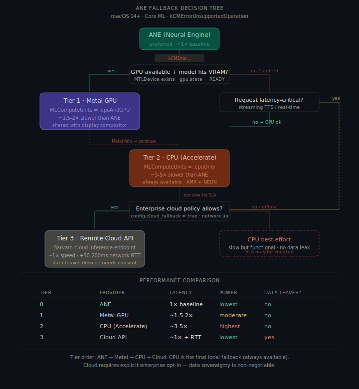
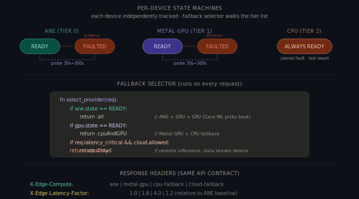

# Part A §4 — Apple Neural Engine Fallback Strategy (macOS)

> **Scenario**: On macOS 14+, the Apple Neural Engine (ANE) is a shared system resource. Core ML returns `kCMErrorUnsupportedOperation` during inference — the ANE is unavailable (claimed by another process, thermally throttled, or the model op isn't ANE-compatible).

### Architecture Context

In-process ANE failure handling within `edge-worker-N` on macOS Apple Silicon:

- **`edge-supervisor`** — receives tier change notifications via IPC (Unix Domain Sockets, MessagePack). Does not intervene — the worker handles escalation autonomously.
- **`edge-gateway`** — reads `device` and `tier` from worker heartbeats to adjust queue depth and throughput expectations.
- **`edge-worker-N`** — contains an in-process Device Manager that owns the 4-tier escalation (ANE → Metal GPU → CPU → Cloud). Per-tier state tracked independently. Worker process stays alive throughout all escalations.

### Assumptions

1. **Core ML supports runtime compute unit selection.** Setting `MLModelConfiguration.computeUnits` to `.cpuAndGPU` or `.cpuOnly` forces Core ML to skip ANE without restarting the process.
2. **ANE unavailability is often transient.** Another process may release the ANE, thermals may recover, or the user may close a competing app.
3. **Metal GPU is available on all Apple Silicon Macs.** Integrated GPU via Metal Performance Shaders — primary fallback before CPU.
4. **Cloud fallback is opt-in and requires explicit enterprise policy.** Disabled by default. When enabled, inference data leaves the device — requires consent and a short-lived keychain token.
5. **Each device tier's quarantine state is independent.** ANE faulted does not affect GPU or CPU.
6. **Quarantine state is in-memory only.** Re-detection after restart costs one failed request per faulted tier — acceptable given ANE issues are transient.

---

## Overview

ANE unavailability is often **transient** — unlike the Qualcomm NPU scenario where the device is truly broken. The fallback uses a **tiered escalation** with three local tiers and one optional remote tier, each independently health-tracked. The API contract never changes.



### Recovery Timeline — ANE → Metal GPU Fallback

| Time | Event | Component | Client impact |
|---|---|---|---|
| `t=0ms` | Core ML returns `kCMErrorUnsupportedOperation` | Worker (Core ML) | Request in progress |
| `t=1ms` | Device Manager marks ANE as `FAULTED`, selects Tier 1 (Metal GPU) | Worker (Device Manager) | None yet |
| `t=2–10ms` | Core ML model reloaded with `.computeUnits = .cpuAndGPU` | Worker | None — model file already in memory |
| `t=10ms` | Same request retried on Metal GPU | Worker | None — client still waiting |
| `t=50–100ms` | Metal GPU inference completes (~1.8× slower than ANE) | Worker | Response with `X-Edge-Compute: metal-gpu` |
| `t=100ms` | IPC notification: `device_event { tier_change: 0→1 }` | Worker → Supervisor | None |
| `t=100ms+` | Worker heartbeat: `device: metal-gpu`, `tier: 1` | Worker → Gateway | Throughput estimate adjusted |
| `t=30s` | First health probe: canary ANE inference | Worker (Device Manager) | None (background) |
| `t=30s+` | Pass → restore ANE. Fail → backoff 60s → 120s → … cap 300s | Worker | If restored: ANE speed resumes |

### Recovery Timeline — Full Escalation (ANE → GPU → CPU → Cloud)

| Time | Trigger | Tier | Provider | Latency factor |
|---|---|---|---|---|
| `t=0ms` | ANE: `kCMErrorUnsupportedOperation` | 0 → 1 | Metal GPU | 1.8× |
| `t=50ms` | GPU: Metal shader compilation fails (rare) | 1 → 2 | CPU (Accelerate) | 4.4× |
| `t=250ms` | CPU succeeds — always stable | 2 (stable) | CPU | 4.4× |
| `t=30s+` | Probe: GPU restored | 2 → 1 | Metal GPU | 1.8× |
| `t=120s+` | Probe: ANE restored | 1 → 0 | ANE | 1.0× |

Cloud (Tier 3) is only reached if cloud is policy-enabled and the request is latency-critical; CPU is always the backstop.

---

## 1. Selection Logic — The Fallback Tier List

| Priority | Tier | Provider | Core ML `MLComputeUnits` | When chosen |
|---|---|---|---|---|
| 0 | **ANE** | Neural Engine | `.all` | Default — Core ML schedules on ANE when available |
| 1 | **Metal GPU** | Apple GPU via Metal | `.cpuAndGPU` | ANE faulted, GPU READY, utilization <80% |
| 2 | **CPU** | Accelerate (AMX + NEON) | `.cpuOnly` | ANE + GPU both faulted, or non-latency-critical request |
| 3 | **Cloud** | Sarvam cloud API | N/A (HTTP) | Latency-critical + local too slow + enterprise policy allows |

### Decision function

```swift
func selectProvider(for request: InferenceRequest) -> ComputeProvider {
    // Tier 0: ANE
    if deviceManager.state(of: .ane) == .ready {
        return .all
    }
    // Tier 1: Metal GPU — only if utilization below contention threshold
    if deviceManager.state(of: .gpu) == .ready,
       modelFitsInUnifiedMemory(request.modelId) {
        return .cpuAndGPU
    }
    // Tier 2 vs Tier 3
    if request.isLatencyCritical,
       config.cloudFallbackAllowed,
       networkMonitor.isReachable {
        return .cloud
    }
    // Tier 2: CPU — always available
    return .cpuOnly
}
```

**GPU before CPU**: Metal compute shaders run ~2× faster than CPU via higher ALU count and same unified memory — but the GPU is shared with the display compositor. If utilization exceeds 80%, the selector skips to CPU to prevent UI jank. **CPU before Cloud**: data sovereignty — inference stays on-device unless the enterprise explicitly opts in. Cloud is restricted to latency-critical requests even when policy-enabled.

---

## 2. Performance Tradeoffs

### Latency per tier

| Tier | Token generation (TTS) | Batch translate (NMT) | Power draw | Thermal impact |
|---|---|---|---|---|
| ANE | ~8ms/token | ~40ms/batch | Very low | Negligible |
| Metal GPU | ~14ms/token | ~70ms/batch | Moderate | Fans may spin up |
| CPU (Accelerate) | ~35ms/token | ~180ms/batch | High | Sustained thermals |
| Cloud API | ~10ms/token + RTT | ~50ms + RTT | Very low (local) | None |

### Metal GPU vs CPU

| Factor | Metal GPU | CPU |
|---|---|---|
| **Speed** | ~1.5–2× slower than ANE | ~3–5× slower than ANE |
| **Availability** | May be contested (display, video) | Always free |
| **Power** | Moderate | High — all P-cores active |
| **Model compatibility** | Some ops not Metal-compatible | All ops supported |
| **Side effects** | UI jank if GPU saturated | System slowness |

### CPU vs Cloud

| Factor | CPU | Cloud |
|---|---|---|
| **Latency** | Predictable (3–5×) | Variable (network RTT) |
| **Data** | Stays on device | Leaves device |
| **Cost** | Free | Per-request billing |
| **Compliance** | Always compliant | Requires enterprise consent |

---

## 3. Failure Escalation Order

Each tier fails independently. A single request cascades through tiers within the same lifecycle — no gateway involvement, no process restart.

```swift
func runInference(_ request: InferenceRequest) throws -> InferenceResult {
    let tiers: [ComputeProvider] = buildTierList(for: request)
    for tier in tiers {
        do {
            let result = try executeOnProvider(request, provider: tier)
            result.metadata.computeProvider = tier
            return result
        } catch let error as CoreMLError where error.isDeviceUnavailable {
            deviceManager.quarantine(tier.deviceType); continue
        } catch let error as MTLError {
            deviceManager.quarantine(.gpu); continue
        }
    }
    fatalError("All tiers exhausted — this shouldn't happen")
}
```

Worst case (ANE fail → GPU fail → CPU succeed): ~50ms cascade overhead. Subsequent requests go directly to the highest available tier — no further overhead.

### Per-device quarantine



| Device | Quarantine trigger | Probe interval | Probe method |
|---|---|---|---|
| **ANE** | `kCMErrorUnsupportedOperation` | 30s → 300s (exp backoff) | Canary Core ML inference with `.all` + result validation |
| **Metal GPU** | `MTLCommandBuffer` error or GPU timeout | 30s → 300s (exp backoff) | Small Metal compute shader + result check |
| **CPU** | Never quarantined | N/A | N/A |
| **Cloud** | Network timeout or 5xx | 15s → 60s (shorter backoff) | `HEAD` to health endpoint |

Cloud backoff is shorter because network issues resolve faster than hardware faults.

---

## 4. Communicating Degraded Mode Without Changing the API Contract

Response body schema is **identical** across all tiers. Degradation is communicated exclusively through **response headers** and an optional `_meta` field.

### Response headers

```http
HTTP/1.1 200 OK
Content-Type: application/json
X-Edge-Compute: metal-gpu
X-Edge-Latency-Factor: 1.8
X-Edge-Device-Status: degraded
X-Edge-Estimated-Restore: 28
X-Edge-Tier: 1
```

| Header | Values | Purpose |
|---|---|---|
| `X-Edge-Compute` | `ane` \| `metal-gpu` \| `cpu-fallback` \| `cloud-fallback` | Which provider served this request |
| `X-Edge-Latency-Factor` | Float | Slowdown relative to ANE baseline |
| `X-Edge-Device-Status` | `healthy` \| `degraded` \| `critical` | `degraded` = ANE down, GPU serving. `critical` = CPU-only. |
| `X-Edge-Estimated-Restore` | Integer (seconds) | Time until next ANE health probe |
| `X-Edge-Tier` | `0` \| `1` \| `2` \| `3` | Numeric tier for programmatic consumption |

### Response body `_meta` field (always present)

```json
{
  "text": "नमस्ते, मैं आपकी मदद कर सकता हूँ।",
  "language": "hi",
  "_meta": {
    "compute": "metal-gpu",
    "tier": 1,
    "latency_ms": 142,
    "baseline_latency_ms": 80,
    "device_status": "degraded",
    "degraded_since": "2025-01-15T10:23:45Z"
  }
}
```

### WebSocket / SSE streaming

```json
{"type": "meta", "compute": "cpu-fallback", "tier": 2, "latency_factor": 4.0, "device_status": "critical"}
{"type": "token", "text": "नमस्ते"}
{"type": "done", "total_ms": 850}
```

### Device health endpoint

```
GET /v1/health/devices
```

```json
{
  "ane": { "state": "faulted", "since": "2025-01-15T10:23:45Z", "next_probe_s": 28 },
  "gpu": { "state": "ready" },
  "cpu": { "state": "ready" },
  "cloud": { "state": "ready", "policy": "allowed", "reachable": true },
  "active_tier": 1,
  "active_provider": "metal-gpu"
}
```

A client written before the fallback system existed continues to work unchanged — it receives `200 OK` with valid data and simply ignores the new headers and `_meta` field.

---

## 5. Scheduler Interaction During ANE Fallback

Worker stays in pool throughout. The scheduler adapts via heartbeat:

1. **Worker stays in pool** — no removal, no re-registration. Current tier reported in each heartbeat.
2. **Throughput estimate adjusts** — `ane` → baseline; `metal-gpu` → 1.8×; `cpu` → 4×; `cloud` → 1× + RTT.
3. **Queue depth scales** — effective limit reduced proportionally: 64 → 32 at Tier 1, 64 → 16 at Tier 2 (both ANE and GPU faulted).
4. **No re-routing** — sticky routing continues; same worker, same loaded model.
5. **Restoration is transparent** — probe passes → next heartbeat updates tier → scheduler restores queue depth automatically.

**Heartbeat during degraded state:**
```msgpack
{"type": "heartbeat", "worker_id": "worker-0", "state": "idle",
 "device": "metal-gpu", "tier": 1, "devices_faulted": ["ane"]}
```

---

## 6. State/Event Payload Examples

### Device Manager internal state (all 4 tiers)

```json
{
  "ane": {
    "state": "FAULTED", "faulted_at": "2025-01-15T10:23:45Z",
    "error": "kCMErrorUnsupportedOperation",
    "probe_attempt": 1, "next_probe_at": "2025-01-15T10:24:45Z",
    "backoff_interval_s": 60
  },
  "gpu": {"state": "READY", "utilization_pct": 42, "metal_device": "Apple M3 Pro"},
  "cpu": {"state": "READY", "cores": 12, "performance_cores": 6},
  "cloud": {"state": "READY", "policy": "allowed", "reachable": true},
  "active_tier": 1, "active_provider": "metal-gpu"
}
```

### Worker → Supervisor (tier change event)

```msgpack
{
  "type": "device_event", "worker_id": "worker-0", "event": "tier_change",
  "from_tier": 0, "to_tier": 1,
  "from_provider": "ane", "to_provider": "metal-gpu",
  "reason": "kCMErrorUnsupportedOperation",
  "timestamp": "2025-01-15T10:23:45.123Z"
}
```

### Worker → Supervisor (ANE restored)

```msgpack
{
  "type": "device_event", "worker_id": "worker-0", "event": "tier_change",
  "from_tier": 1, "to_tier": 0,
  "from_provider": "metal-gpu", "to_provider": "ane",
  "reason": "health_probe_passed", "probe_attempts": 2, "downtime_s": 90,
  "timestamp": "2025-01-15T10:25:15.456Z"
}
```

### Worker → Gateway (cloud fallback inference response)

```msgpack
{
  "type": "inference_response", "request_id": "req_9b2f", "status": "ok",
  "compute_provider": "cloud", "tier": 3, "latency_ms": 95,
  "cloud_rtt_ms": 45, "model_id": "indic-tts-v3"
}
```

---

## 7. Design Tradeoffs

| Decision | Chosen | Alternative | Rationale |
|---|---|---|---|
| **4-tier waterfall** | Ordered tier list with per-request cascade | Binary fallback (ANE or CPU only) | Metal GPU is 2× faster than CPU on Apple Silicon. Cloud covers latency-critical edge cases. |
| **In-process cascade** | Catch error, retry next tier in same function | Kill worker, restart with different compute flag | Input tensors in memory. ~50ms cascade vs ~3s restart. |
| **Per-device independent quarantine** | Each tier has its own state machine | Single "degraded" flag for the whole worker | ANE can recover while GPU is faulted. Independent tracking prevents unnecessary downgrades. |
| **GPU utilization threshold (80%)** | Skip GPU if >80% utilized | Always try GPU if READY | Saturating GPU causes UI jank (compositing, animation). |
| **Cloud requires explicit opt-in** | `config.cloud_fallback = true` + `latency_critical` | Cloud as automatic fallback | Data sovereignty is Edge's core value. Cloud must be intentional enterprise decision. |
| **Shorter cloud backoff (15s → 60s)** | Faster probe cycle for network tier | Same 30s → 300s as local devices | Network issues resolve faster than hardware faults. |
| **CPU never quarantined** | Always the last resort | Allow quarantine on thermal throttle | Accelerate is a software library — it can slow but cannot "fail" in the device sense. |
| **Same API contract across all tiers** | Headers + `_meta` only | Different schemas per tier | Clients written before fallback system still work unchanged. |

---

## 8. Performance & Reliability

| Metric | ANE (Tier 0) | Metal GPU (Tier 1) | CPU (Tier 2) | Cloud (Tier 3) | Notes |
|---|---|---|---|---|---|
| Token generation (TTS) | ~8ms/token | ~14ms/token | ~35ms/token | ~10ms + RTT | RTT typically 20–80ms |
| Batch translation (NMT) | ~40ms | ~70ms | ~180ms | ~50ms + RTT | |
| Session swap time | N/A | ~30ms | ~20ms | N/A (HTTP) | Core ML recompile for new compute units |
| Cascade overhead (worst case) | N/A | ~50ms | ~80ms | ~120ms | ANE fail → GPU fail → CPU succeed |
| Health probe overhead | ~3ms | ~5ms | N/A | ~20ms | Canary model or HEAD request |
| **Worst-case single-request** | 8ms | **64ms** | **115ms** | **130ms + RTT** | Includes cascade + inference |

**Reliability guarantees**: no request lost (cascades to CPU) · no process restart · bounded degradation (CPU deterministic) · data sovereignty (cloud opt-in only) · independent recovery per device · silent corruption caught by canary result validation · GPU jank prevention via utilization check.

---

## Summary

| Question | Answer |
|---|---|
| **Selection logic** | Tiered waterfall: ANE → Metal GPU → CPU → Cloud. Per-request decision on device state, GPU utilization, latency criticality, and enterprise cloud policy. |
| **Performance tradeoffs** | GPU: 1.5–2× slower, shared with display. CPU: 3–5× slower, always available. Cloud: ~1× + RTT, data leaves device. |
| **Escalation order** | In-process cascade. ANE fail → GPU → CPU → Cloud. CPU always succeeds. ~50ms overhead for double-fallback. |
| **Client communication** | `X-Edge-Compute` + `X-Edge-Latency-Factor` + `X-Edge-Device-Status` headers. `_meta` in response body. `/v1/health/devices`. API contract unchanged — always `200 OK`. |

---

## 9. Cloud Authentication and Offline Policy

### Policy matrix

| Enterprise policy | Local tiers available | Action |
|---|---|---|
| `cloud_fallback = false` | Any local tier available | Continue local execution |
| `cloud_fallback = false` | No local tier (unexpected) | Deterministic local failure + remediation hint |
| `cloud_fallback = true` | Local degraded + request latency-critical | Allow Tier 3 cloud fallback |

Cloud auth: short-lived token from enterprise provisioning path, stored in OS keychain only. `401/403` quarantines cloud tier separately — does not block CPU fallback.

---

## 10. Thermal and Memory Guardrails

GPU is skipped if unified memory headroom is below threshold, utilization exceeds 80%, or thermal state is `serious`/`critical`. This protects UI quality during sustained degradation.

```json
{
  "gpu": {
    "state": "READY", "utilization_pct": 83,
    "unified_mem_free_mb": 1024,
    "admission": "denied_high_utilization"
  },
  "thermal": {"state": "serious", "policy": "prefer_cpu"}
}
```

---

*Sarvam AI — Edge Runtime Team — Backend Intern Assignment*
