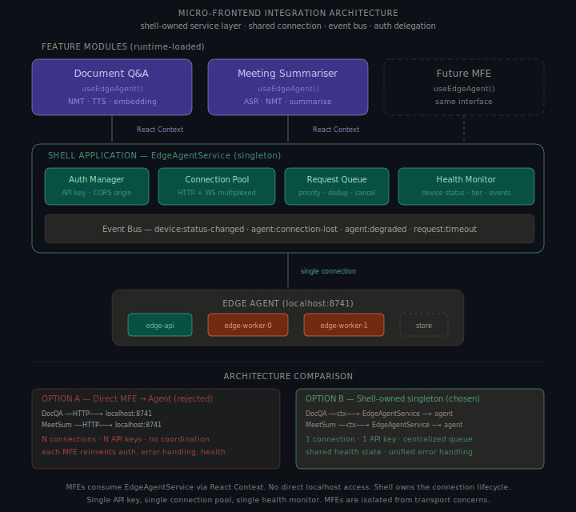
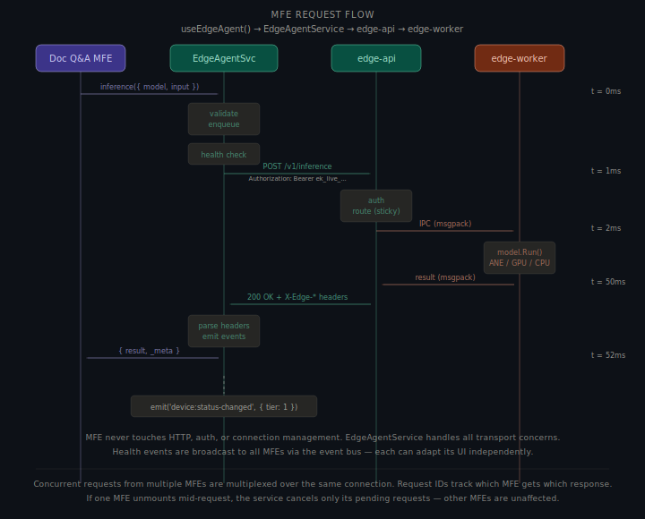
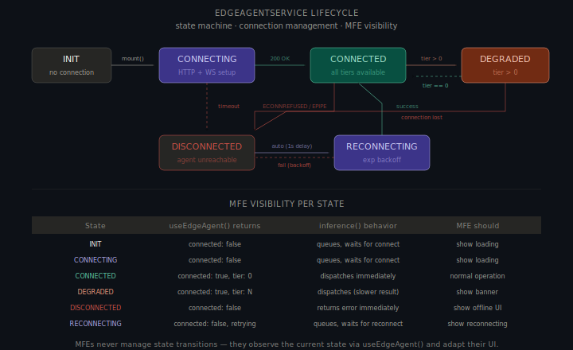
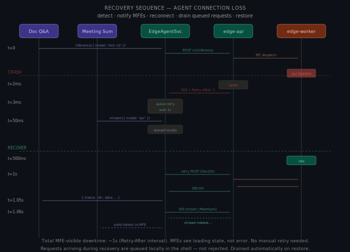
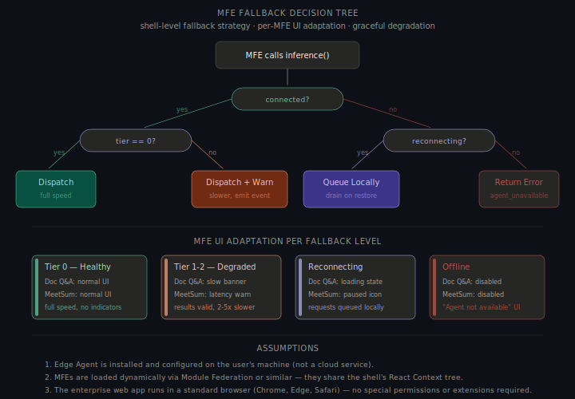
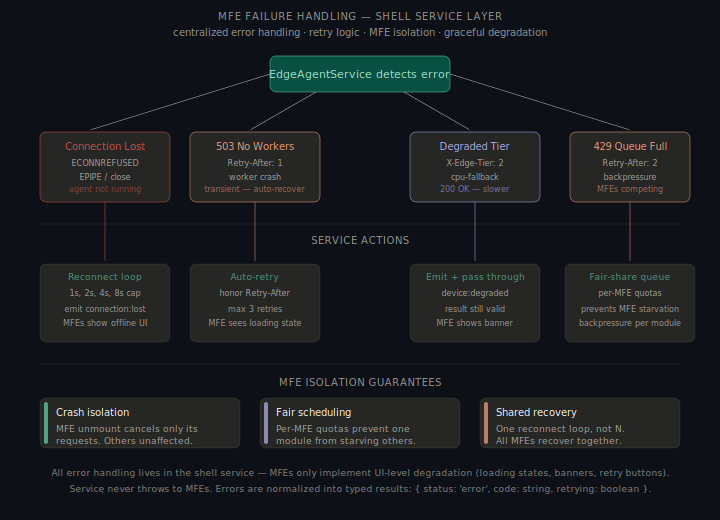

# Part B §1 — Micro-Frontend Integration Architecture

> **Scenario**: An enterprise web application uses a Micro-Frontend (MFE) architecture. A React shell application dynamically loads feature modules at runtime. Two MFEs — **Document Q&A** and **Meeting Summariser** — need access to the Edge Agent running on `localhost:8741`.

---

## Overview

The core question: should each MFE talk directly to the Edge Agent, or should the shell own the connection?

**Answer: The shell owns the connection.** The shell provides a shared `EdgeAgentService` singleton via React Context. MFEs never call `localhost:8741` directly — the Edge Agent is a bounded-queue, single-API-key local service that requires coordinated access.



### Assumptions

- **Pre-installed agent** at `127.0.0.1:8741`. Web app handles its absence gracefully.
- **MFEs loaded dynamically** via Module Federation. They share the shell's React Context tree.
- **Single-tab, per-tab queue** — 8 slots per tab, not global. Multiple tabs each get their own `EdgeAgentService`.
- **OS keychain API key** — provisioned per enterprise, retrieved once at startup. Key rotation handled by admin console, transparent to MFEs.
- **MFEs are untrusted** — developed by different teams, potentially compromised via supply chain. Shell treats them as consumers, not peers.

---

## 1. The Decision: Shell-Owned vs Direct MFE Access

### Option A — Direct MFE → Agent (rejected)

Each MFE independently creates an HTTP client, manages its own API key, opens its own WebSocket, and handles connection failures.

```
┌─────────────┐     HTTP     ┌──────────────┐
│ Document Q&A │────────────→│              │
└─────────────┘              │  Edge Agent  │
                              │  :8741       │
┌─────────────┐     HTTP     │              │
│ Meeting Sum. │────────────→│              │
└─────────────┘              └──────────────┘
```

### Option B — Shell-Owned Singleton (chosen)

The shell creates a single `EdgeAgentService` instance. MFEs consume it through a React Context provider. They call `useEdgeAgent()` and get back a typed API — no HTTP, no auth, no connection management.

```
┌─────────────┐  Context   ┌──────────────────┐  HTTP   ┌──────────────┐
│ Document Q&A │──────────→│ EdgeAgentService  │────────→│  Edge Agent  │
└─────────────┘            │  (shell singleton) │        │  :8741       │
                            │  - 1 connection    │        │              │
┌─────────────┐  Context   │  - 1 API key       │        │              │
│ Meeting Sum. │──────────→│  - shared queue     │        │              │
└─────────────┘            └──────────────────┘         └──────────────┘
```

---

## 2. Tradeoff Analysis

| Concern | Option A (Direct) | Option B (Shell-Owned) |
|---|---|---|
| **Connections** | N connections — one per MFE, competing for a service designed for 1–2 clients. | 1 HTTP + 1 WebSocket, multiplexed via request IDs. |
| **API key** | Key in N closures — any compromised MFE leaks it. | One key in the shell; MFEs never handle it. |
| **Auth + CSP** | Each MFE injects headers; CSP must allowlist `localhost:8741` per MFE origin. | Shell owns auth. CSP: `connect-src 'self'`. |
| **Request coordination** | MFEs compete for the 64-slot queue; one can starve the other. | Fair-share queue with per-MFE quotas and priority mapping. |
| **Health monitoring** | N poll intervals, N `X-Edge-*` header parsers — one per MFE. | One poll; cached result broadcast via event bus. |
| **Failure handling** | Each MFE retries and reconnects inconsistently. | Centralized. MFEs receive typed `InferenceResult` — no raw HTTP errors. |

**Why Option B wins**: Bounded queue, single API key, and shared health state require a single coordinator. N independent clients can't self-coordinate; the mock-context independence tradeoff is trivial.

---

## 3. Architecture: EdgeAgentService

### Service structure

```typescript
class EdgeAgentService {
    async inference(req: InferenceRequest): Promise<InferenceResult>;
    async stream(req: InferenceRequest): AsyncGenerator<StreamChunk>;
    subscribe(event: EdgeEvent, handler: EventHandler): Unsubscribe;
    getDeviceStatus(): DeviceStatus;
    getConnectionState(): ConnectionState;
}
```

### React integration

```tsx
// Shell application root
function App() {
    return (
        <EdgeAgentProvider config={{ endpoint: 'http://127.0.0.1:8741' }}>
            <MicroFrontendHost />
        </EdgeAgentProvider>
    );
}
```

```tsx
// Inside Document Q&A MFE
function DocumentQA() {
    const { inference, deviceStatus } = useEdgeAgent();
    const translate = (text: string) => inference({
        model: 'indic-nmt-v2', input: text,
        params: { source_lang: 'en', target_lang: 'hi' }, priority: 'normal', caller: 'doc-qa',
    }); // returns Promise<InferenceResult> — never throws
    return <div>{deviceStatus === 'degraded' && <DegradedBanner />}...</div>;
}
```

```tsx
// Inside Meeting Summariser MFE
function MeetingSummariser() {
    const { stream, subscribe } = useEdgeAgent();
    useEffect(() => subscribe('device:status-changed', (s) => { if (s.tier >= 2) showSlowWarning(); }), []);
    // stream({ model: 'indic-asr-v1', priority: 'high', caller: 'meeting-sum' }) → AsyncGenerator<StreamChunk>
}
```



---

## 4. Process Lifecycle: EdgeAgentService State Machine

The `EdgeAgentService` has six states. Transitions are driven by connection events — MFEs observe state but never trigger transitions directly.



```
INIT ──mount()──→ CONNECTING ──200 OK──→ CONNECTED ──tier > 0──→ DEGRADED
                      │                      │                        │
                      │ timeout              │ EPIPE                  │ conn lost
                      ↓                      ↓                        ↓
                 DISCONNECTED ──auto──→ RECONNECTING ──success──→ CONNECTED
                      ↑                      │
                      └────────fail──────────┘
```

| State | `useEdgeAgent()` returns | `inference()` behavior | MFE should |
|---|---|---|---|
| `INIT` | `{ connected: false, state: 'init' }` | Queues request, waits for connection | Show loading spinner |
| `CONNECTING` | `{ connected: false, state: 'connecting' }` | Queues request, waits for connection | Show loading spinner |
| `CONNECTED` | `{ connected: true, tier: 0, status: 'healthy' }` | Dispatches immediately | Normal operation |
| `DEGRADED` | `{ connected: true, tier: N, status: 'degraded' }` | Dispatches (result is slower) | Show "reduced performance" banner |
| `DISCONNECTED` | `{ connected: false, state: 'disconnected' }` | Returns error immediately | Show offline UI with retry button |
| `RECONNECTING` | `{ connected: false, state: 'reconnecting', attempt: N }` | Queues request, drains on restore | Show "reconnecting..." indicator |

### Lifecycle rules

- **Mount** → `INIT → CONNECTING`; on 200 OK → `CONNECTED`, drains queued requests.
- **`X-Edge-Tier > 0`** → `DEGRADED`, emits `device:status-changed`; returns to `CONNECTED` when tier=0.
- **Connection loss** (`ECONNREFUSED`, `EPIPE`, WS close) → `DISCONNECTED → RECONNECTING` (backoff 1s, 2s, 4s, 8s cap).
- **Unmount** → cancels all in-flight requests, destroys connection, clears state.

---

## 5. Recovery Sequence: Agent Connection Loss

When the Edge Agent goes down, the shell manages recovery. MFEs are shielded from the complexity.



| Time | Event | Shell action | MFE experience |
|---|---|---|---|
| `t = 0ms` | Doc Q&A calls `inference()` | Dispatches over HTTP | Sees loading state |
| `t = 2ms` | Agent process dies | HTTP returns `ECONNREFUSED` | — |
| `t = 3ms` | Shell detects connection loss | `→ DISCONNECTED`. Emits `connection:lost`. Starts timer (1s). | `useEdgeAgent()` → `{ connected: false }`. Doc Q&A request queued for retry. |
| `t = 50ms` | Meeting Sum calls `stream()` | Request queued locally | Meeting Sum sees `{ connected: false, state: 'reconnecting' }` |
| `t = 500ms` | Agent worker restarts | — | — |
| `t = 1s` | Reconnect fires | Shell connects. `→ CONNECTED`. Emits `connection:restored`. | Both MFEs see `{ connected: true }` |
| `t = 1.01s` | Shell drains queue | Retries Doc Q&A. Dispatches Meeting Sum stream. | Doc Q&A resolves (~1s delay). Meeting Sum stream begins. |

**Key properties**: MFEs don't re-invoke `inference()` — the original promise resolves on restore. Requests are **queued, not rejected** for up to 30s. After 30s: `{ status: 'error', code: 'agent_unavailable' }`. One reconnect loop serves all MFEs simultaneously.

---

## 6. Fallback Decision Tree

When an MFE calls `inference()`, the shell runs a synchronous decision tree before dispatching:



```
MFE calls inference()
  │
  ├─ connected?
  │   ├─ YES → tier == 0?
  │   │         ├─ YES → Dispatch at full speed → { status: 'ok' }
  │   │         └─ NO  → Dispatch (slower) → { status: 'degraded', degradation: {...} }
  │   │                   → emit device:status-changed
  │   └─ NO → reconnecting?
  │           ├─ YES → Queue locally, drain on restore → loading state
  │           │         → timeout after 30s → { status: 'error', code: 'agent_unavailable' }
  │           └─ NO  → { status: 'error', code: 'agent_unavailable' }
  │                     → MFE shows offline UI
```

### MFE UI adaptation per fallback level

| Level | Trigger | Doc Q&A UI | Meeting Summariser UI |
|---|---|---|---|
| **Healthy** (tier 0) | Normal | Normal — instant results | Normal — real-time transcription |
| **Degraded** (tier 1–2) | `device:status-changed` | "Slower than usual" banner. Extends timeout. | "Transcription may be delayed" warning. Still functional. |
| **Reconnecting** | `connection:lost` | Spinner. "Connecting to AI engine..." | Paused icon. Buffered audio queued. |
| **Offline** | Failures >30s | Disabled input. "Edge Agent not available." | Disabled recording. Same message. |

UI adaptation is optional — a basic MFE that ignores events still works correctly.

---

## 7. Security Implications

### API key isolation

| Aspect | Direct (Option A) | Shell-Owned (Option B) |
|---|---|---|
| **Key exposure** | Each MFE has the key in its closure. A compromised MFE leaks the key. | Only the shell has the key. Compromised MFE can call `inference()` but can't exfiltrate the raw key. |
| **Key rotation** | Each MFE handles refresh independently. Race conditions during rotation. | Shell handles rotation once. MFEs are unaware. |
| **CORS origin** | Each MFE must be on the allowlist. N origins to manage. | One origin (the shell's). Simpler CORS config. |

### Attack surface reduction

A compromised MFE can only call `useEdgeAgent().inference()` through the shell's validation layer — it cannot bypass schema validation, access the raw key, or reach shell-only endpoints like `/v1/health/devices`.

### Content Security Policy

Option B enables a stricter CSP:

```http
Content-Security-Policy: connect-src 'self';
```

MFEs make no direct network requests. With Option A, CSP must allow `connect-src http://127.0.0.1:8741` for every MFE origin.

---

## 8. Resource Coordination

### The problem: bounded queue contention

The Edge Agent's gateway has a 64-slot bounded queue (16 high-priority + 48 normal). Without coordination:
- Meeting Summariser streams real-time ASR (high-priority, continuous)
- Document Q&A fires batch translations (normal-priority, bursty)

Document Q&A can trigger `429` that blocks Meeting Summariser too. Meeting Summariser can fill the high-priority lane.

### The solution: Fair-share queue in the shell

```typescript
interface FairShareConfig {
    maxConcurrent: number;        // total in-flight requests (default: 8)
    perCallerMax: number;         // max in-flight per MFE (default: 4)
    priorityMapping: Record<string, 'high' | 'normal'>;
}
```

| MFE | Default quota | Priority | Rationale |
|---|---|---|---|
| Meeting Summariser | 4 concurrent | `high` | Real-time — latency-sensitive |
| Document Q&A | 4 concurrent | `normal` | Batch — throughput-sensitive |
| Total in-flight | 8 | — | Leaves headroom in the agent's 64-slot queue for retries |

MFEs never see `429` — the shell queues excess requests locally and absorbs backpressure.

### Connection pooling

One HTTP/1.1 keep-alive connection + one WebSocket, multiplexed via `request_id`. Responses are routed to the originating MFE's pending promise via an `inflightRequests` map. The shell never opens a second connection regardless of how many MFEs are active.

---

## 9. Failure Handling



| Failure | HTTP code | Service action | MFE experience |
|---|---|---|---|
| **Agent not running** | `ECONNREFUSED` | Reconnect loop (1s, 2s, 4s, 8s cap). Emit `connection:lost`. | `{ connected: false }`. MFE shows offline UI. |
| **Worker crash** | `503` + `Retry-After: 1` | Auto-retry after `Retry-After`. Max 3 retries. | Loading state. If all fail: `{ status: 'error', code: 'no_workers' }`. |
| **Queue full** | `429` + `Retry-After: 2` | Shell reduces dispatch rate. Queues excess locally. | Longer load time, not an error. |
| **Degraded tier** | `200` + `X-Edge-Tier: 2` | Parse headers, update cached status, emit `device:degraded`. | Valid result (slower) + optional degradation banner. |
| **Request timeout** | — | Cancel in-flight. Return typed error. | `{ status: 'error', code: 'timeout' }`. |
| **MFE unmount** | — | Cancel all pending requests for that MFE's `caller` ID. | Other MFEs unaffected. No orphaned requests. |

### Error normalization

The service **never throws** to MFEs. Every call returns a typed result:

```typescript
type InferenceResult = 
    | { status: 'ok'; data: unknown; meta: ResponseMeta }
    | { status: 'error'; code: ErrorCode; message: string; retrying: boolean }
    | { status: 'degraded'; data: unknown; meta: ResponseMeta; degradation: DegradationInfo };
```

MFEs switch on `status`. They never parse HTTP status codes, headers, or connection errors.

---

## 10. Scheduler Architecture & Queueing Model

```
MFEs → FairShareQueue (shell, 8 slots) → EdgeConnection → edge-api queue (64 slots) → workers
```

### Two-level queueing

| Level | Location | Size | Purpose |
|---|---|---|---|
| **L1 (shell)** | `FairShareQueue` in browser | 8 in-flight | Per-MFE fairness, priority, client-side backpressure |
| **L2 (agent)** | `edge-api` gateway queue | 64 slots | Server-side scheduling, sticky routing, worker dispatch |

The shell never sends more than 8 concurrent requests — the agent's 64-slot queue is never saturated by this browser tab, leaving room for other clients (Electron apps, extensions, other tabs).

### Priority mapping

Priority: `meeting-sum → high` (real-time transcription), `doc-qa → normal` (batch translation). High-priority requests skip ahead in the shell queue. Shell priority and agent priority are **aligned but independent** — the shell dispatches in priority order, but can't override agent-side scheduling.

### Backpressure propagation

When agent returns `429`: shell pauses dispatch, honors `Retry-After`, reduces `maxConcurrent` from 8 → 4 temporarily, queues new MFE requests locally. Restores `maxConcurrent` after successful requests resume.

---

## 11. API Contract Examples

### MFE → Shell (React Context API)

```typescript
const result = await inference({
    model: 'indic-nmt-v2', input: 'Hello, how are you?',
    params: { source_lang: 'en', target_lang: 'hi' }, priority: 'normal', caller: 'doc-qa',
});
// ok:       { status: 'ok',       data: { text: '...' }, meta: { compute: 'ane', tier: 0, latency_ms: 42 } }
// degraded: { status: 'degraded', data: {...}, degradation: { reason: 'ane_faulted', latency_factor: 4.4 } }
// error:    { status: 'error', code: 'no_workers', retrying: true }
```

### Shell → Edge Agent (HTTP — hidden from MFEs)

```http
POST /v1/inference HTTP/1.1
Host: 127.0.0.1:8741
Authorization: Bearer ek_live_...
Content-Type: application/json
X-Request-Id: req_7f3a9b
X-Caller-Id: doc-qa

{"model": "indic-nmt-v2", "input": "Hello, how are you?", "params": {"source_lang": "en", "target_lang": "hi"}}
```

```http
HTTP/1.1 200 OK
X-Edge-Compute: ane
X-Edge-Latency-Factor: 1.0
X-Edge-Device-Status: healthy
X-Edge-Tier: 0

{"result": {"text": "नमस्ते, आप कैसे हैं?"}, "_meta": {"compute": "ane", "tier": 0, "latency_ms": 42}}
```

### WebSocket stream + health subscription

```typescript
// MFE streams via AsyncGenerator (shell owns the WS)
for await (const chunk of stream({ model: 'indic-asr-v1', input: audioBlob, caller: 'meeting-sum' })) {
    appendTranscript(chunk.text);  // WS frames: meta → token* → done
}

// Shell polls health; MFEs subscribe to derived events
subscribe('device:status-changed', ({ tier, compute, latency_factor }) => {
    if (tier >= 2) showSlowWarning();
});
```

---

## 12. State/Event Payload Examples

### EdgeAgentService internal state

```json
{
    "connection": { "state": "connected", "http_alive": true, "ws_alive": true, "reconnect_attempt": 0 },
    "device":     { "tier": 1, "compute": "metal-gpu", "status": "degraded", "latency_factor": 1.8 },
    "queue":      { "in_flight": 3, "max_concurrent": 8,
                    "per_caller": { "doc-qa": { "in_flight": 1, "max": 4 }, "meeting-sum": { "in_flight": 2, "max": 4 } } }
}
```

### Event bus payloads

```typescript
// Connection
{ type: 'connection:lost' } | { type: 'connection:reconnecting', attempt: 2, next_retry_ms: 4000 } | { type: 'connection:restored', downtime_ms: 6200 }
// Device (parsed from X-Edge-* headers)
{ type: 'device:status-changed', tier: 2, compute: 'cpu-fallback', latency_factor: 4.2 } | { type: 'device:restored', tier: 0, compute: 'ane' }
// Queue / per-MFE
{ type: 'queue:backpressure', reduced_max: 4, reason: '429_received' }
{ type: 'caller:request-queued', caller: 'doc-qa', position: 3, reason: 'quota_exceeded' }
{ type: 'caller:requests-cancelled', caller: 'meeting-sum', count: 2, reason: 'unmount' }
```

---

## 13. Design Tradeoff Explanations

| Decision | Chosen | Alternative | Rationale |
|---|---|---|---|
| **Shell-owned singleton** | Single `EdgeAgentService` in shell | Each MFE connects directly | Bounded queue (64) + single API key require coordination. N clients can't self-coordinate. |
| **React Context for MFE access** | `EdgeAgentProvider` + `useEdgeAgent()` | Module Federation shared module / global | Context is the standard React composition primitive. Easy to mock. No global state pollution. |
| **Fair-share queue (client-side)** | Per-MFE quotas, shell-level queue | Let MFEs compete for agent queue | Prevents starvation. MFEs never see 429. Agent queue isn't saturated by one browser tab. |
| **Typed result (no throws)** | Return `{ status, data, meta }` union | Throw on HTTP errors | Degradation is a first-class UI state, not an exception. MFEs don't need `try/catch`. |
| **Event bus for health** | Shell emits events, MFEs subscribe | MFEs poll health independently | One poll interval, shared state. MFEs react to events instead of duplicating health checks. |
| **Single HTTP + WS connection** | Multiplexed via request IDs | Per-MFE connections | One connection to localhost is sufficient. Avoids N TCP handshakes and N socket FDs. |
| **8-slot shell queue** | Conservative — well below 64 | Match agent's 64-slot limit | Leaves headroom for other clients (Electron, extensions, other tabs). |
| **Priority mapping by caller** | `meeting-sum: high`, `doc-qa: normal` | All requests same priority | Real-time transcription has stricter latency requirements than batch translation. |
| **Cancel on unmount** | `AbortController` per MFE caller | Let requests complete after unmount | Orphaned requests waste agent queue slots. Cancellation frees resources for active MFEs. |

---

## 14. Performance & Reliability

| Metric | Value |
|---|---|
| Shell overhead per request | < 0.5ms |
| Connection setup (once) | ~5ms |
| Request multiplexing | ~0.1ms |
| Event bus dispatch | ~0.05ms |
| Health poll interval | 10s (single poll, cached) |
| Memory overhead | ~50KB |

| Concern | Mitigation |
|---|---|
| **Shell crash** | Stateless service. Shell restart recreates `EdgeAgentService`. Nothing to persist. |
| **MFE crash** | `AbortController` cancels that caller's requests. Other MFEs unaffected. |
| **Agent restart** | Shell reconnects (exp backoff 1s → 8s). All MFEs see `connected: false` simultaneously. |
| **Degraded device** | Shell parses `X-Edge-*` headers once, caches, emits event. MFEs adapt UI without polling. |
| **MFE starvation** | Per-caller quotas (default: 4 concurrent). One MFE can't monopolize the queue. |

**Reliability guarantees**: no MFE sees raw HTTP errors · no MFE manages connections · no MFE competes unfairly · no MFE is affected by another's crash · health state is consistent across all MFEs.

---

## 15. Streaming + Capacity Contention

Scenario: Meeting Summariser has 4/4 high-priority slots active. User submits a Document Q&A query.


**Expected behavior**: active streaming slots are preserved; Doc Q&A enters the shell queue with position + ETA; fair-share + anti-starvation aging ensures both MFEs make progress.

### Queue event payloads

```json
{ "type": "caller:request-queued",   "caller": "doc-qa",       "queue_position": 2, "estimated_start_ms": 1800 }
{ "type": "caller:state-transition", "caller": "doc-qa",       "from": "queued", "to": "in_flight", "slot": "worker-1" }
```

Each MFE sees full detail for its own requests; only aggregate pressure for others (no payload leakage). **Retry**: exp backoff (1s, 2s, 4s, max 3); `Retry-After` honored; same `request_id` reused for idempotency. **Cancel**: `AbortController` frees the slot and emits `stream:cancelled`.


---

## Summary

| Question | Answer |
|---|---|
| **Shell or direct?** | Shell owns the connection. `EdgeAgentService` singleton via React Context. MFEs call `useEdgeAgent()`. |
| **Why not direct?** | Bounded queue, single API key, shared health state — coordinated resources need a mediator. N independent clients can't self-coordinate. |
| **Security** | API key held only by shell. MFEs can't exfiltrate it. Stricter CSP (`connect-src 'self'`). Request validation at the shell layer. |
| **Resource coordination** | Fair-share queue with per-MFE quotas (4 concurrent each). Priority mapping (real-time > batch). Client-side backpressure absorption. |
| **Failure handling** | Centralized retry, reconnect, error normalization. MFEs get typed results, never raw HTTP. One reconnect loop, not N. Cancel on unmount. |

---

*Sarvam AI — Edge Runtime Team — Backend Intern Assignment*
