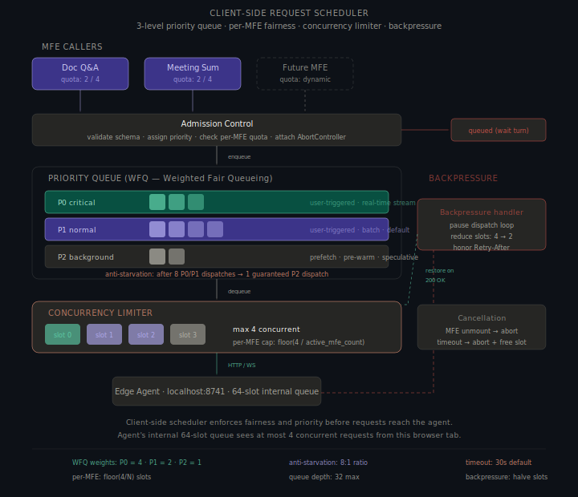
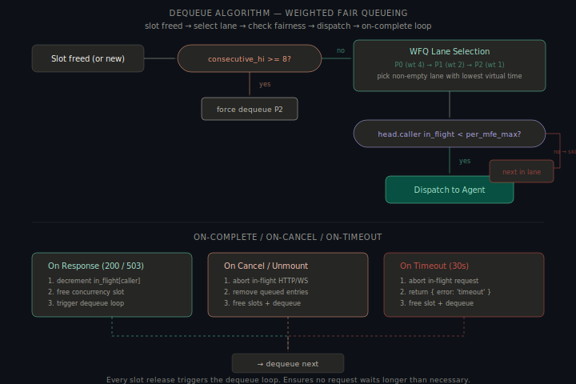
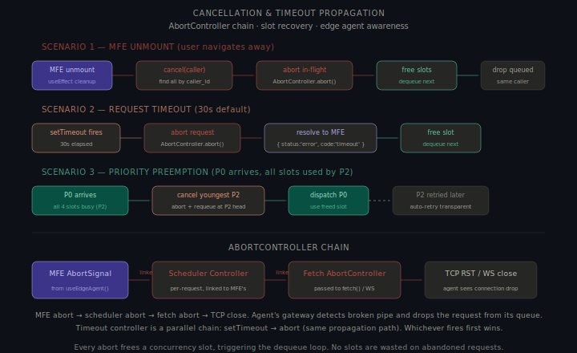
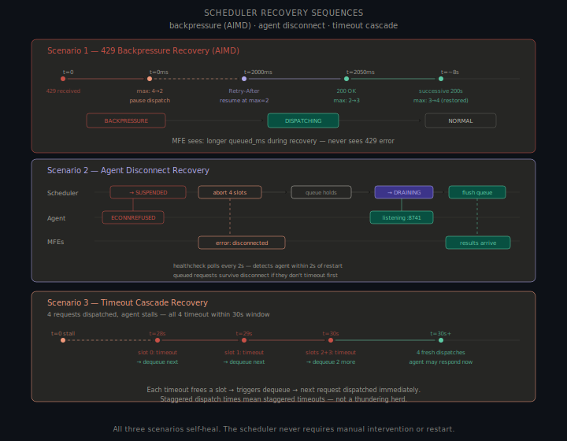
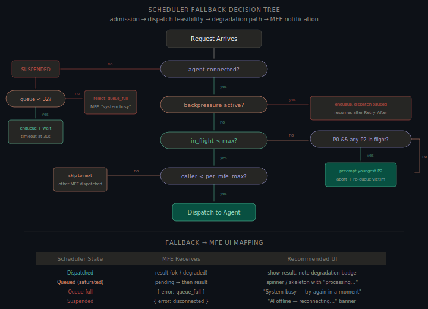

# Part B §2 — Client-Side Request Scheduler

> **Constraint**: The Edge Agent can handle a maximum of **4 concurrent inference requests**. Additional requests must queue. The scheduler must enforce per-MFE fairness, support priority-based scheduling, handle cancellation and timeout, and prevent starvation of low-priority workloads.

---

## Overview

The scheduler is a component inside the shell's `EdgeAgentService` (Part B §1). It sits between the MFEs' `inference()` / `stream()` calls and the HTTP/WebSocket connection to the Edge Agent, enforcing a **4-slot concurrency limit** with per-MFE fairness, priority ordering, cancellation, and timeout.



### Assumptions

1. **4-slot concurrency limit** is hard. A 5th concurrent request returns `429`. The scheduler must never exceed this.
2. **Two MFEs active** (Document Q&A + Meeting Summariser); scheduler must scale to N without code changes.
3. **Three priority levels**: critical (real-time), normal (user batch), background (prefetch). Cancellation must propagate via TCP RST so the agent frees its internal slot. Requests are independent — no FIFO ordering required.

---

## 1. Queue Structure

### Three-level priority queue with Weighted Fair Queueing

The scheduler uses three priority lanes, each a FIFO queue. The lanes are served using **Weighted Fair Queueing (WFQ)** — not strict priority — to prevent starvation.

```
┌──────────────────────────────────────────────────────┐
│                  Priority Queue                       │
│                                                       │
│  P0 [critical]   ■ ■ □ □      weight: 4             │
│  P1 [normal]     ■ ■ ■ □      weight: 2             │
│  P2 [background] ■ □           weight: 1             │
│                                                       │
│  Total queue depth limit: 32 entries                  │
│  Per-MFE queue depth limit: 16 entries                │
└──────────────────────────────────────────────────────┘
         │
         │ dequeue (WFQ)
         ▼
┌──────────────────────────────────────────────────────┐
│              Concurrency Limiter                      │
│                                                       │
│  [ slot 0 ] [ slot 1 ] [ slot 2 ] [ slot 3 ]        │
│                                                       │
│  Max concurrent: 4                                    │
│  Per-MFE max: floor(4 / active_mfe_count)            │
└──────────────────────────────────────────────────────┘
         │
         │ HTTP / WebSocket
         ▼
    Edge Agent (localhost:8741)
```

### Priority levels

| Level | Name | Weight | Use cases | Timeout |
|---|---|---|---|---|
| **P0** | `critical` | 4 | User-triggered real-time: live transcription, interactive TTS, streaming Q&A | 30s |
| **P1** | `normal` | 2 | User-triggered batch: document translation, summarisation, search | 30s |
| **P2** | `background` | 1 | Prefetch, speculative pre-computation, model warm-up | 60s |

### How MFEs assign priority

Priority is set by the MFE at call time via the `priority` field:

```typescript
// Real-time transcription — critical
await stream({ model: 'indic-asr-v1', input: audio, priority: 'critical', caller: 'meeting-sum' });

// User clicks "Translate" — normal
await inference({ model: 'indic-nmt-v2', input: text, priority: 'normal', caller: 'doc-qa' });

// Pre-fetch next page's translation — background
await inference({ model: 'indic-nmt-v2', input: nextPageText, priority: 'background', caller: 'doc-qa' });
```

The scheduler validates priority but does not override it. MFEs are trusted to classify their own requests correctly — they know their UX context better than the scheduler.

### Queue entry

```typescript
interface QueueEntry {
    id: string; caller: string; priority: 'critical' | 'normal' | 'background';
    request: InferenceRequest; enqueuedAt: number; // for starvation detection
    abortController: AbortController;
    resolve: (result: InferenceResult) => void;
    timeoutId: number;
}
```

---

## 2. Scheduling Policy

### Weighted Fair Queueing (WFQ)

Strict priority scheduling (always serve P0 before P1 before P2) causes **starvation** — a continuous stream of P0 real-time transcription requests would permanently block all P1 and P2 work. WFQ prevents this.

Each priority lane has a **virtual time** counter. When enqueued:

```
virtual_finish_time = virtual_time + (1 / weight)
```

Dequeue picks the non-empty lane with the **lowest virtual finish time**. P0 (weight 4) is dequeued 4× as often as P2 (weight 1) — but P2 still gets served. Anti-starvation hard guard: after 8 consecutive P0/P1 dispatches without any P2, a P2 is forced to the front.

### Dispatch ratio under load

With all three lanes full and continuous arrivals:

| Lane | Weight | Share of dispatches | Example: 7 dispatches |
|---|---|---|---|
| P0 (`critical`) | 4 | 4/7 = 57% | 4 dispatches |
| P1 (`normal`) | 2 | 2/7 = 29% | 2 dispatches |
| P2 (`background`) | 1 | 1/7 = 14% | 1 dispatch |

Plus the hard anti-starvation guard: after 8 consecutive P0/P1 dispatches without any P2, a P2 request is forced to the front. This guarantees P2 is served at least once every 9 dispatches regardless of WFQ timing.

### Priority preemption

When a P0 `critical` request arrives and all 4 concurrency slots are occupied by P2 `background` requests, the scheduler **preempts**:

1. Selects the youngest (most recently dispatched) P2 request
2. Aborts its HTTP connection via `AbortController.abort()`
3. Re-enqueues the aborted P2 request at the head of the P2 lane (so it's retried next)
4. Dispatches the P0 request into the freed slot

Preemption is P0→P2 only. P0 does not preempt P1 (too much wasted user-triggered work).



---

## 3. Concurrency Management

### Per-MFE fairness

The concurrency limiter enforces two constraints simultaneously:

1. **Global limit**: at most 4 requests in-flight total
2. **Per-MFE limit**: at most `floor(4 / active_mfe_count)` requests in-flight per MFE

With 2 active MFEs, each gets at most 2 concurrent slots. With 3 MFEs, each gets 1 slot (with 1 slot available for whoever's next in the queue). With 1 MFE, it gets all 4.

```typescript
function canDispatch(entry: QueueEntry): boolean {
    if (totalInFlight >= maxConcurrent) return false;
    const perMFEMax = Math.max(1, Math.floor(maxConcurrent / countDistinctCallers()));
    return callerInFlight[entry.caller] < perMFEMax;
}
```

**Slot accounting**: `ConcurrencyLimiter` tracks `totalInFlight` and `callerInFlight` as a Map. `acquire()` increments both; `release()` decrements and triggers the dequeue loop.

---

## 4. Cancellation and Timeout Propagation



### AbortController chain

Every request has a three-level abort chain:

```
MFE's AbortSignal  →  Scheduler's AbortController  →  fetch() AbortController
     (from hook)            (per-request)                 (HTTP/WS)
```

When any level aborts:

1. The signal propagates down the chain
2. The HTTP connection is closed (TCP RST or WebSocket close frame)
3. The Edge Agent detects the broken pipe and drops the request from its internal queue
4. The concurrency slot is freed
5. The dequeue loop fires, dispatching the next waiting request

### MFE unmount cancellation

When an MFE unmounts, React cleanup calls `scheduler.cancelByCaller(caller)`. The scheduler aborts all in-flight requests for that caller via `AbortController`, removes queued entries, and frees slots. Other MFEs are unaffected.

### Timeout propagation

Every request gets a timeout at enqueue time (`30s` for critical/normal, `60s` for background). The timer covers both **queue wait** and **in-flight** time — a request that waits 25s then takes 6s will fail at 30s total. On fire: abort → `{ status: 'error', code: 'timeout' }` → release slot.

### Timeout by priority

| Priority | Timeout | Rationale |
|---|---|---|
| `critical` | 30s | User is waiting for real-time output. 30s is the UX upper bound. |
| `normal` | 30s | User triggered this. Same UX bound. |
| `background` | 60s | No user waiting. Allow longer queue time. Still bounded to prevent resource leaks. |

---

## 5. Starvation Prevention

### The starvation problem

Without protection, low-priority workloads can be permanently blocked:

- Meeting Summariser continuously streams P0 `critical` ASR requests
- Document Q&A submits P2 `background` prefetch requests
- Under WFQ alone, P2 gets 1/7 of dispatches — but if P0 arrivals outpace P2 dispatches, the P2 queue grows unbounded and eventually times out

### Three starvation defenses

**Defense 1: WFQ weights guarantee minimum share**

WFQ mathematically guarantees each lane gets at least `weight / total_weight` of dispatches. P2 gets at least 1/7 (14%) of all dispatches as long as slots are available.

**Defense 2: Hard anti-starvation guard (8:1 ratio)**

After 8 consecutive dispatches from P0/P1 lanes without any P2 dispatch, the scheduler **forces** a P2 dequeue regardless of virtual finish times. This is the safety net — it guarantees P2 gets at least 1 dispatch per 9 cycles.

**Defense 3: Age-based promotion** — P2 queued >10s promoted to P1; P1 queued >20s promoted to P0. Checked on every dequeue cycle (~0.1ms for ≤32 entries).

### Starvation guarantees

| Workload | Guarantee | Mechanism |
|---|---|---|
| P2 `background` | Served at least once every 9 dispatches | WFQ + 8:1 hard guard |
| P2 `background` | Promoted to P1 after 10s wait | Age-based promotion |
| P1 `normal` | Gets 2/7 of dispatches under contention | WFQ weight = 2 |
| P1 `normal` | Promoted to P0 after 20s wait | Age-based promotion |
| Any request | Times out after 30s (60s for P2) | Timeout propagation |

---

## 6. Backpressure Handling

### When the agent pushes back

Even with the 4-slot limit, the agent can return `429 Too Many Requests` if other clients (Electron apps, other browser tabs, extensions) are also sending requests.

### Backpressure protocol

On `429 Retry-After: N`: pause dispatch, halve `maxConcurrent` (AIMD multiplicative decrease). After N seconds: resume at reduced concurrency. On each subsequent `200 OK`: increment `maxConcurrent` by 1 (additive increase) until cap 4 restored. MFEs never see `429` — they see slower results. Queue absorbs excess locally up to 32 entries; at 32 rejects with `{ status: 'error', code: 'queue_full' }`.

---

## 7. Process Lifecycle

The scheduler has six internal states. MFEs do not observe these states directly — they are exposed indirectly through `queued_ms`, `connected`, and error codes returned by `inference()` / `stream()`.


### States

| State | Entry condition | Queue behavior | Slot behavior | MFE experience |
|---|---|---|---|---|
| **IDLE** | No requests pending or in-flight | Accept + dispatch immediately | 0/4 used | Instant results |
| **DISPATCHING** | At least 1 request in-flight, slots available | WFQ dequeue active | 1–3/4 used | May see brief `queued_ms` |
| **SATURATED** | All 4 slots occupied, queue non-empty | Enqueue; P0 may preempt P2 | 4/4 used | Loading spinner |
| **BACKPRESSURE** | 429 received from agent | Enqueue; dispatch paused | AIMD: max reduced to 1–2 | Longer wait times |
| **SUSPENDED** | Agent disconnected (ECONNREFUSED / WebSocket close) | Enqueue with 30s timeout | All frozen, no dispatch | "AI offline" banner |
| **DRAINING** | Agent reconnected after SUSPENDED | Rapid WFQ dequeue | Filling 0 → 4 | Burst of results |

### Transitions

```
IDLE ──request arrives──→ DISPATCHING
DISPATCHING ──4/4 full──→ SATURATED
SATURATED ──slot freed──→ DISPATCHING
DISPATCHING ──queue empty + all done──→ IDLE
DISPATCHING ──429 received──→ BACKPRESSURE
SATURATED ──429 received──→ BACKPRESSURE
BACKPRESSURE ──Retry-After + 200 OK──→ DISPATCHING
DISPATCHING ──ECONNREFUSED──→ SUSPENDED
SATURATED ──ECONNREFUSED──→ SUSPENDED
SUSPENDED ──connection:restored──→ DRAINING
DRAINING ──queue flushed──→ DISPATCHING
```

Transitions fire `scheduler:state_change` events. The state machine has no timers — all scheduling is event-driven (slot freed, request arrived, 429 received, agent reconnected).

---

## 8. Recovery Sequences

The scheduler self-heals from three failure scenarios without manual intervention or restart.



### Scenario 1 — 429 Backpressure Recovery (AIMD)

| Time | Event | Scheduler action | State |
|---|---|---|---|
| t=0 | Agent returns `429 Retry-After: 2` | Halve `maxConcurrent` (4→2), pause dispatch | BACKPRESSURE |
| t=2s | Retry-After timer expires | Resume dispatch at reduced concurrency (max=2) | DISPATCHING |
| t=~2.05s | Next response is `200 OK` | Additive increase: max 2→3 | DISPATCHING |
| t=~4s | Another `200 OK` | Additive increase: max 3→4 | DISPATCHING |
| t=~8s | Steady state restored | Full concurrency, no queueing | DISPATCHING or IDLE |

MFE experience: longer `queued_ms` during recovery window. No error codes exposed.

### Scenario 2 — Agent Disconnect Recovery

| Time | Event | Scheduler action | State |
|---|---|---|---|
| t=0 | `ECONNREFUSED` or WebSocket close | Abort all 4 in-flight requests, return `{ error: 'disconnected' }` | SUSPENDED |
| t=0+ | New requests arrive | Enqueued with 30s timeout (not rejected) | SUSPENDED |
| t=0–30s | Health-check polls every 2s | Probing `localhost:8741` for reconnection | SUSPENDED |
| t=Xs | Agent starts listening again | Health-check succeeds, connection:restored event | DRAINING |
| t=Xs+ | Queued requests dispatched | Rapid WFQ dequeue, slots fill 0→4 | DRAINING → DISPATCHING |

If the agent is down longer than 30s, queued requests timeout individually. New requests submitted during SUSPENDED still get a 30s window — the timeout starts at enqueue time, not at the disconnect event.

### Scenario 3 — Timeout Cascade Recovery

When the agent stalls (accepting connections but not responding), all 4 in-flight requests will timeout at staggered intervals:

| Time | Event | Result |
|---|---|---|
| t=28s | Oldest request (dispatched at t=0) hits 30s total timeout | Abort, free slot, dequeue next |
| t=29s | Second-oldest times out | Free slot, dequeue next |
| t=30s | Remaining 2 requests timeout | Free 2 slots, dequeue 2 |
| t=30s+ | 4 fresh requests dispatched | If agent recovered, results arrive normally |

Key design: because requests are dispatched at different times (staggered by slot availability), their timeouts fire at different times. This prevents a thundering herd where all 4 slots free simultaneously and 4 new requests hit a still-stalled agent.

### Sweep timer safety net

A 60s `setInterval` scans in-flight requests. Any slot held longer than 60s is force-aborted and resolved `{ status: 'error', code: 'slot_leak_recovery' }`. This catches edge cases where browser timer throttling (background tabs) silently delays normal timeout fires.

---

## 9. Fallback Decision Tree

When a request cannot follow the normal dispatch path, the scheduler walks a decision tree to determine the appropriate fallback.



### Decision flow

```
Request arrives
  ├─ Agent disconnected?
  │     ├─ YES → SUSPENDED
  │     │     ├─ Queue < 32? → enqueue (timeout 30s, wait for reconnect)
  │     │     └─ Queue full? → reject: { error: 'queue_full' }
  │     └─ NO ↓
  ├─ Backpressure active?
  │     ├─ YES → enqueue, dispatch paused (resumes after Retry-After)
  │     └─ NO ↓
  ├─ Slot available (in_flight < max)?
  │     ├─ NO → is P0 and any P2 in-flight?
  │     │     ├─ YES → preempt youngest P2, dispatch P0
  │     │     └─ NO → enqueue in priority lane (SATURATED)
  │     └─ YES ↓
  ├─ Per-MFE quota available (caller < per_mfe_max)?
  │     ├─ NO → skip, dispatch next MFE's request from queue
  │     └─ YES ↓
  └─ DISPATCH to agent
```

### Fallback → MFE UI mapping

Each fallback path produces a specific response that MFEs should map to a UI state:

| Scheduler fallback | MFE receives | Recommended UI |
|---|---|---|
| **Direct dispatch** | `{ status: 'ok', data, meta: { queued_ms: 0 } }` | Show result immediately |
| **Queued (saturated)** | `{ status: 'ok', data, meta: { queued_ms: 1200 } }` | Spinner → result (with "processing..." label) |
| **Queued (backpressure)** | `{ status: 'ok', data, meta: { queued_ms: 3500 } }` | Spinner → result (longer, but same UI) |
| **Degraded dispatch** | `{ status: 'degraded', data, degradation }` | Show result + "running slower" badge |
| **Timeout** | `{ status: 'error', code: 'timeout' }` | "Request timed out. Try again?" with retry button |
| **Queue full** | `{ status: 'error', code: 'queue_full' }` | "System busy — please try again in a moment" |
| **Disconnected** | `{ status: 'error', code: 'disconnected' }` | "AI engine offline — reconnecting..." with auto-retry |
| **Preempted (P2 only)** | P2 caller: transparent re-queue. No error visible. | No UI change — request retries automatically |

The scheduler translates all transport failures into typed `InferenceResult` responses. MFEs never see `429`, `503`, or `ECONNREFUSED` — this keeps MFE code decoupled from HTTP semantics and lets the transport layer change without touching MFE code.

---

## 10. Scheduler Architecture Diagram

The full data flow from MFE call to agent dispatch:

```
MFE calls inference()
  │
  ▼
┌─ Admission Control ─────────────────────────────────────────┐
│  1. Validate request schema                                  │
│  2. Assign priority (from request.priority)                  │
│  3. Create QueueEntry with AbortController + timeout timer   │
│  4. Check total queue depth (< 32?) — reject if full         │
│  5. Check per-MFE queue depth (< 16?) — reject if full       │
└──────────────────────────────────────────────────────────────┘
  │
  ▼
┌─ Priority Queue (WFQ) ──────────────────────────────────────┐
│  P0 [critical]   weight 4   — real-time, user-facing         │
│  P1 [normal]     weight 2   — user-triggered batch           │
│  P2 [background] weight 1   — prefetch, speculative          │
│                                                               │
│  Anti-starvation: 8:1 hard guard + age-based promotion       │
└──────────────────────────────────────────────────────────────┘
  │
  ▼
┌─ Concurrency Limiter ───────────────────────────────────────┐
│  Global max: 4 (AIMD-adjusted: may be 1-4)                  │
│  Per-MFE max: floor(4 / active_mfe_count)                   │
│                                                               │
│  If MFE at quota: skip to next entry in queue                │
│  If P0 and all slots P2: preempt youngest P2                 │
└──────────────────────────────────────────────────────────────┘
  │
  ▼
┌─ Dispatch ──────────────────────────────────────────────────┐
│  Send HTTP POST / WS frame to localhost:8741                 │
│  Attach AbortController signal to fetch()                    │
│  Start timeout timer (30s / 60s)                             │
│                                                               │
│  On response: free slot → dequeue loop                       │
│  On 429: AIMD decrease → pause → retry                       │
│  On timeout: abort → free slot → return error to MFE         │
│  On MFE unmount: abort → free slot → drop queued             │
└──────────────────────────────────────────────────────────────┘
```

---

## 11. API Contract Examples

### MFE → Scheduler

```typescript
// Real-time (P0)
await stream({ model: 'indic-asr-v1', input: audioChunk, priority: 'critical', caller: 'meeting-sum' });
// User action (P1)
await inference({ model: 'indic-nmt-v2', input: 'Hello', priority: 'normal', caller: 'doc-qa' });
// Prefetch (P2)
await inference({ model: 'indic-nmt-v2', input: nextText, priority: 'background', caller: 'doc-qa' });
```

### Scheduler → MFE (response union)

```typescript
{ status: 'ok',       data: { text: '...' }, meta: { compute: 'ane', tier: 0, latency_ms: 42,  queued_ms: 0    } }
{ status: 'ok',       data: { text: '...' }, meta: { compute: 'ane', tier: 0, latency_ms: 42,  queued_ms: 1200 } }
{ status: 'degraded', data: { text: '...' }, meta: { compute: 'cpu-fallback', tier: 2, latency_ms: 185 },
  degradation: { reason: 'ane_faulted', latency_factor: 4.4 } }
{ status: 'error', code: 'timeout',       retrying: false }
{ status: 'error', code: 'queue_full',    retrying: false }
{ status: 'error', code: 'disconnected',  retrying: true  }
```

### Scheduler → Edge Agent (internal HTTP)

```http
POST /v1/inference HTTP/1.1
Host: 127.0.0.1:8741
Authorization: Bearer ek_live_...
X-Request-Id: req_7f3a9b
X-Caller-Id: doc-qa
X-Priority: normal

{"model": "indic-nmt-v2", "input": "Hello", "params": {"source_lang": "en", "target_lang": "hi"}}
```

---

## 12. State/Event Payload Examples

```json
{
    "concurrency": { "max": 4, "effective_max": 4, "in_flight": 3,
                     "per_caller": { "doc-qa": { "in_flight": 1, "queued": 2, "max": 2 },
                                     "meeting-sum": { "in_flight": 2, "queued": 0, "max": 2 } } },
    "queues":       { "critical": { "length": 0 }, "normal": { "length": 2 }, "background": { "length": 1 } },
    "starvation":   { "consecutive_high_priority": 3, "oldest_queued_age_ms": 2400 },
    "backpressure": { "active": false, "aimd_state": "normal" }
}
```

```typescript
{ type: 'scheduler:queued',           request_id: 'req_7f3a', caller: 'doc-qa',      priority: 'normal',     position: 3 }
{ type: 'scheduler:dispatched',       request_id: 'req_7f3a', caller: 'doc-qa',      queued_ms: 1200 }
{ type: 'scheduler:backpressure',     reason: '429_received', max_reduced_to: 2,     retry_after_ms: 2000 }
{ type: 'scheduler:promoted',         request_id: 'req_9c1b', from: 'background',    to: 'normal', wait_ms: 10200 }
{ type: 'scheduler:preempted',        victim_id: 'req_2d4e',  preemptor_id: 'req_8a1f', victim_requeued: true }
```

---

## 13. Design Tradeoff Explanations

| Decision | Chosen | Alternative | Rationale |
|---|---|---|---|
| **WFQ over strict priority** | WFQ (4:2:1) | Strict P0 > P1 > P2 | Strict priority causes starvation. WFQ guarantees minimum share per lane. |
| **3 priority levels** | critical / normal / background | 2 or 5+ levels | 3 maps cleanly to real-time, interactive, speculative. 2 is too coarse; 5+ adds config burden. |
| **Per-MFE quota = floor(4/N)** | Dynamic (recomputed per dispatch) | Fixed quota | Dynamic adapts to mount/unmount. Fixed wastes slots when MFEs are inactive. |
| **P0 preempts P2 only** | Critical aborts background | Any higher preempts any lower | P0 preempting P1 wastes user-triggered work. P0→P2 is safe — background requests are speculative. |
| **Age-based promotion** | P2→10s P1; P1→20s P0 | No promotion | Prevents WFQ math + queue depth from delaying a request past its timeout. |
| **AIMD for backpressure** | Halve on 429, +1 on 200 | Fixed pause + retry | AIMD converges to available capacity. Fixed strategies over- or under-throttle. |
| **Total timeout (queue+inflight)** | 30s covers wait + inference | Separate queue + inference timeouts | Simpler for MFEs: “result or error within 30s”, no invisible queue time surprises. |
| **Queue depth limit (32)** | Bounded, reject at capacity | Unbounded | Unbounded queues silently accumulate latency. At 36 total, system is overloaded — fail fast. |

---

## 14. Performance & Reliability

### Performance

| Metric | Value | Notes |
|---|---|---|
| Enqueue overhead | ~0.1ms | Create QueueEntry + insert into priority lane |
| Dequeue (WFQ select) | ~0.05ms | Compare 3 virtual finish times |
| Per-MFE fairness check | ~0.02ms | Map lookup + integer comparison |
| Anti-starvation check | ~0.01ms | Single counter comparison |
| Age promotion scan | ~0.1ms | Iterate at most 32 entries |
| AbortController propagation | ~0.01ms | Signal fires synchronously |
| Total scheduler overhead | **< 0.3ms per request** | Negligible vs inference latency (~50ms) |
| Memory overhead | ~20KB | 32-entry queue + 4 in-flight trackers + counters |

### Throughput under contention

| Scenario | Effective throughput | Queue depth | P2 share |
|---|---|---|---|
| 1 MFE, all P1 | 4 concurrent, no queueing | 0 | N/A |
| 2 MFEs, mixed P0+P1 | 4 concurrent, fair 2+2 split | Low | WFQ-determined |
| 2 MFEs, continuous P0 + bursty P2 | 4 concurrent, P2 gets 1/7 | Moderate | 14% + promotion |
| 3 MFEs, all P1, bursty | 4 concurrent, 1+1+1 + rotating 4th | High | N/A |
| Backpressure (429) | 1-2 concurrent, AIMD recovery | High | Same WFQ ratios |

### Reliability

| Concern | Mitigation |
|---|---|
| **Slot leak** | Every code path (response, cancel, timeout, error) calls `release()`. Belt: a 60s sweep timer frees any slot held longer than the max timeout. |
| **Starvation** | WFQ weights + 8:1 hard guard + age-based promotion. Three independent mechanisms. |
| **Queue overflow** | Hard limit at 32 entries. Reject with `queue_full` error — MFE shows "system busy". |
| **Agent overload** | AIMD reduces concurrency on 429. Never sends more than `maxConcurrent` requests. |
| **MFE crash** | AbortController chain aborts all pending work. Slots freed. Other MFEs unaffected. |
| **Timeout accumulation** | Total timeout (queue + inflight) prevents silent latency. Age promotion escalates old requests. |
| **Priority inversion** | P0 preempts P2. Age promotion escalates stuck requests. |

### Reliability guarantees

- **No slot leak**: every path (response, cancel, timeout, error) calls `release()`. 60s sweep timer as safety net.
- **No starvation**: WFQ + 8:1 hard guard + age promotion — three independent defenses.
- **No MFE monopolization**: per-MFE quota enforced on every dispatch.
- **No silent queueing**: total timeout covers queue wait + inference. Always resolves within 30s (60s for background).
- **No 429 exposed**: AIMD absorbs backpressure. MFEs see slower results, not HTTP errors.

---

## Summary

| Question | Answer |
|---|---|
| **Queue structure** | Three-level priority queue (critical/normal/background) with WFQ weights (4:2:1). 32-entry depth limit. Per-MFE sub-limits. |
| **Scheduling policy** | Weighted Fair Queueing — not strict priority. P0 gets 4/7 of dispatches, P2 gets 1/7. Anti-starvation hard guard (8:1). Age-based promotion (P2→P1 at 10s, P1→P0 at 20s). |
| **Concurrency management** | 4-slot global limit. Per-MFE quota = `floor(4/N)`. Dynamic — adapts as MFEs mount/unmount. P0 can preempt P2 when all slots are busy. |
| **Backpressure handling** | AIMD on 429: halve concurrency, additive restore on 200. Never exposes 429 to MFEs. Queue absorbs excess locally. Reject at 32 entries (last resort). |
| **Cancellation** | AbortController chain: MFE → scheduler → fetch → TCP RST. Propagates to agent. Slots freed immediately. MFE unmount cancels all that MFE's work. |
| **Starvation prevention** | Three defenses: WFQ weights, 8:1 hard guard, age-based promotion. P2 is guaranteed service even under continuous P0 load. |

---

*Sarvam AI — Edge Runtime Team — Backend Intern Assignment*
