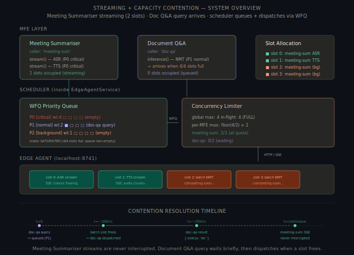
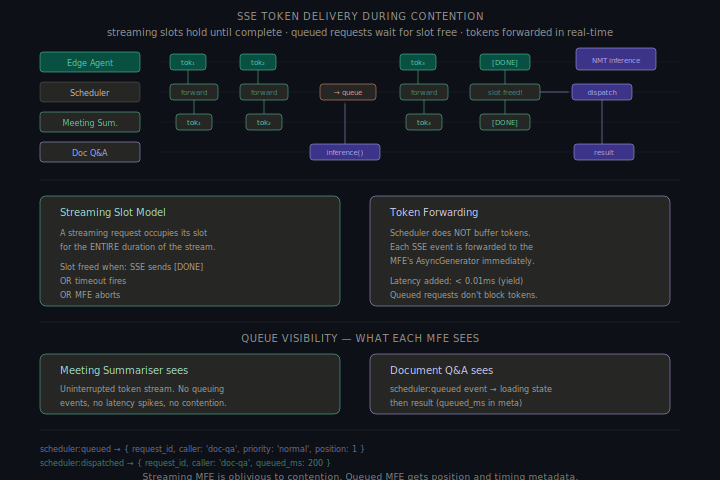
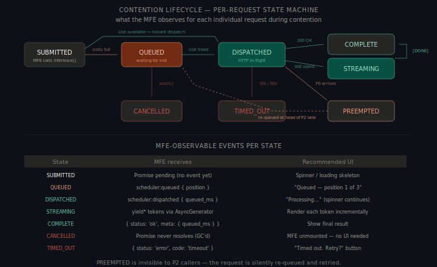
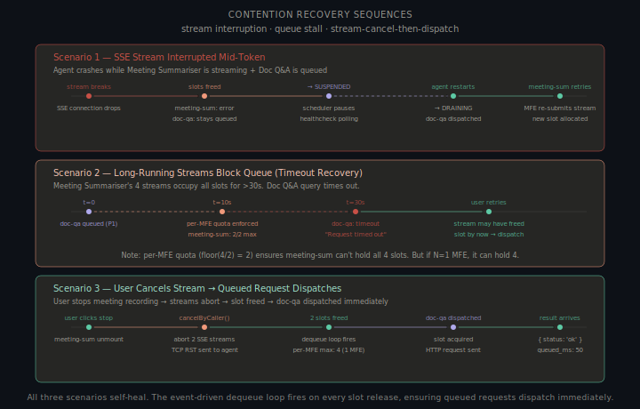
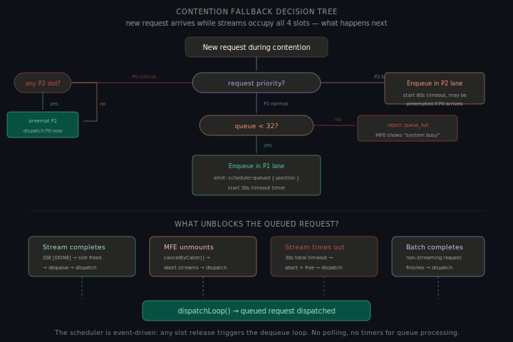

# Part B §3 — Streaming + Capacity Contention Scenario

> **Scenario**: The Meeting Summariser MFE is streaming tokens through SSE (live ASR transcription). While streaming is active, the user opens the Document Q&A MFE and submits a query. At this moment, the Edge Agent is already at capacity (4/4 active slots).

---

## Overview

Defines the UX contract between the scheduler and both MFEs during streaming contention. Tests every scheduler mechanism — WFQ, per-MFE fairness, cancellation, timeout, queue visibility — under real load.



### Assumptions

1. **Meeting Summariser holds 2 slots** — ASR + TTS, both P0 `critical`, long-running SSE streams.
2. **Two other slots occupied** — batch requests completing. 4/4 slots full.
3. **Document Q&A submits P1 `normal`** — user-triggered translation; user is waiting.
4. **Per-MFE quota = floor(4/2) = 2** — both MFEs active.
5. **Scheduler in SATURATED state** — no free slots when Doc Q&A arrives.
6. **SSE holds a slot for the entire stream** — slot freed only on `[DONE]`, timeout, or abort.

---

## 1. System Architecture — Contention Layout

### Slot allocation at moment of contention

```
Edge Agent Slots (4/4 occupied):
┌─────────────────────────────────────────────────────────────┐
│  slot 0: meeting-sum  ASR stream (P0)   ── SSE tokens ──→  │
│  slot 1: meeting-sum  TTS stream (P0)   ── SSE audio  ──→  │
│  slot 2: [batch]      completing...      ── HTTP 200   ──→  │
│  slot 3: [batch]      completing...      ── HTTP 200   ──→  │
└─────────────────────────────────────────────────────────────┘

Scheduler Queue:
┌─────────────────────────────────────────────────────────────┐
│  P0 [critical]   □ □ □ □     (empty)                        │
│  P1 [normal]     ■ □ □ □     (doc-qa query — just arrived)  │
│  P2 [background] □ □ □ □     (empty)                        │
└─────────────────────────────────────────────────────────────┘

Per-MFE counters:
  meeting-sum:  2/2 in-flight (at quota)
  doc-qa:       0/2 in-flight (waiting)
```

4/4 slots full is the steady state under load, not an error. Scheduler enqueues P1 in the normal lane and starts a 30s timeout. P1 cannot preempt P0 — cutting live transcription is irreversible damage.

---

## 2. What Each MFE Receives

### Meeting Summariser — uninterrupted stream

Meeting Summariser is oblivious to contention. SSE streams continue with zero interruption, zero latency change, and no notification of Doc Q&A's queue state (`chunk.meta.contention` is not a field).

**Token delivery during contention**:

| Property | Value | Notes |
|---|---|---|
| Token latency | Unchanged (~5-15ms per token) | Scheduler forwards SSE events immediately, no buffering |
| Token ordering | Preserved | SSE is ordered by definition; scheduler does not reorder |
| Jitter | None introduced | Scheduler adds < 0.01ms overhead (async yield) |
| Backpressure | None applied | Streaming slots are not throttled by queue depth |
| Notification of contention | None | Meeting Summariser has no visibility into other MFEs' queue state |

### Document Q&A — queued, then dispatched

`inference()` returns a Promise that won't resolve immediately. The scheduler emits `scheduler:queued` (with position) when enqueued, and `scheduler:dispatched` when a slot is acquired. `result.meta.queued_ms` reveals the actual queue wait time.

MFEs subscribe via the `EdgeAgentService` event bus:

```typescript
events.on('scheduler:queued',     (e) => e.caller === 'doc-qa' && setQueuePosition(e.position));
events.on('scheduler:dispatched', (e) => e.caller === 'doc-qa' && (setQueuePosition(null), setLoading(true)));
```

---

## 3. When Updates Are Delivered

### Timeline of the contention scenario

```
t=0ms       Doc Q&A submits query
            Scheduler: enqueue P1 lane → emit scheduler:queued { position: 1 }
            Doc Q&A: shows "Queued — position 1". Meeting Summariser: unaffected.

t=0-200ms   Batch on slot 2 or 3 completes → slot freed → dequeue loop fires
            WFQ selects P1 (only non-empty lane). doc-qa: 0/2 in-flight → OK.
            Scheduler dispatches doc-qa → emit scheduler:dispatched { queued_ms: 200 }
            Doc Q&A: shows "Processing..."

t=200-250ms Agent processes NMT → returns 200 OK → Promise resolves
            Doc Q&A: shows translated text. Meeting Summariser: still streaming.
```

### Update delivery guarantees

| Event | Delivery timing | Guarantee |
|---|---|---|
| `scheduler:queued` | Synchronous with `inference()` call | Always emitted when request queued (not when dispatched immediately) |
| `scheduler:dispatched` | When slot is acquired and HTTP request is sent | Always emitted before any response data |
| SSE tokens | Real-time, forwarded within < 0.01ms of receipt | Never buffered, never delayed by queue activity |
| Promise resolution | After full HTTP response (or SSE `[DONE]`) | Exactly once per request |
| Timeout error | 30s after `inference()` call (includes queue time) | Deterministic — covers both queue wait and inference |



---

## 4. Event/State Formats

### Scheduler events emitted during contention

```typescript
// t=0ms: Doc Q&A queued
{ type: 'scheduler:queued',    request_id: 'req_a7f3', caller: 'doc-qa', priority: 'normal',
  position: 1, estimated_wait_ms: 200, timestamp: '2025-01-15T10:23:45.000Z' }

// t=200ms: Doc Q&A dispatched
{ type: 'scheduler:dispatched', request_id: 'req_a7f3', caller: 'doc-qa',
  queued_ms: 200, slot: 2, timestamp: '2025-01-15T10:23:45.200Z' }

// Continuous: Meeting Summariser token (AsyncGenerator yield — not a scheduler event)
{ type: 'stream:token', data: { text: ' transcription fragment' },
  meta: { compute: 'ane', tier: 0, sequence: 47 } }

// Meeting Summariser stream done
{ type: 'stream:done', meta: { compute: 'ane', tier: 0, total_tokens: 312, duration_ms: 15400, latency_first_token_ms: 42 } }

// Doc Q&A inference complete
{ status: 'ok', data: { text: 'नमस्ते, आप कैसे हैं?' },
  meta: { compute: 'ane', tier: 0, latency_ms: 48, queued_ms: 200, request_id: 'req_a7f3' } }
```

### Scheduler internal state during contention

```json
{ "state": "saturated",
  "concurrency": { "max": 4, "in_flight": 4,
    "per_caller": { "meeting-sum": { "in_flight": 2, "queued": 0, "max": 2, "streaming": 2 },
                    "doc-qa":      { "in_flight": 0, "queued": 1, "max": 2, "streaming": 0 } } },
  "queues": { "critical": { "length": 0 }, "normal": { "length": 1 }, "background": { "length": 0 } },
  "active_streams": [
    { "request_id": "req_8b1c", "caller": "meeting-sum", "type": "asr", "tokens_delivered": 312 },
    { "request_id": "req_9d2e", "caller": "meeting-sum", "type": "tts", "chunks_delivered": 47 } ] }
```

---

## 5. Queue Visibility Rules

### What MFEs can see

MFEs do **not** have direct access to the scheduler's internal state. They receive information through two channels:

1. **Event bus** — scheduler emits events that any MFE can subscribe to
2. **Response meta** — `queued_ms` field in the response tells the MFE how long its request waited

### Visibility matrix

| Information | Meeting Summariser | Document Q&A | Shell (DevTools) |
|---|---|---|---|
| Own stream tokens | Yes (AsyncGenerator) | N/A | Yes (event bus) |
| Own queue position | N/A (not queued) | Yes (scheduler:queued event) | Yes |
| Other MFE's queue position | **No** | **No** | Yes |
| Other MFE's streaming status | **No** | **No** | Yes |
| Total slots in use | **No** | **No** | Yes |
| Why request was queued | **No** | **No** (just "queued") | Yes (full state dump) |
| Queue wait time after completion | N/A | Yes (response.meta.queued_ms) | Yes |

### Design rationale: limited visibility

MFEs see only their own requests because: (1) **Isolation** — cross-MFE state creates coupling between teams; (2) **Security** — an MFE compromise should not leak other MFEs' usage patterns; (3) **Simplicity** — `queued_ms` and position events are sufficient for correct UI.

### Queue position event

`position` is the effective dispatch order (WFQ + per-MFE fairness), not raw FIFO index. If Meeting Summariser adds a P0 request, Doc Q&A moves from position 1 → 2 and receives:

```typescript
{ type: 'scheduler:position_changed', request_id: 'req_a7f3', caller: 'doc-qa', old_position: 1, new_position: 2 }
```

---

## 6. Loading/Progress Semantics

### Doc Q&A loading states

The MFE should display loading states based on scheduler events:

```typescript
type LoadingState =
    | { phase: 'submitting' }
    | { phase: 'queued'; position: number; estimate_ms?: number }
    | { phase: 'processing' }
    | { phase: 'complete'; data: unknown; queued_ms: number }
    | { phase: 'error'; code: string; message: string };
```

`DocQALoadingIndicator` renders: `Submitting...` → `Queued — position N` → `Processing...` → `null` (result) or `<ErrorBanner>`.
```

### Meeting Summariser streaming states

The streaming MFE has a simpler model — it's either receiving tokens or it's not:

```typescript
type StreamingState =
    | { phase: 'connecting' }
    | { phase: 'streaming'; tokens: number }
    | { phase: 'done'; total_tokens: number; duration_ms: number }
    | { phase: 'error'; code: string };
```

`TranscriptionIndicator` renders: `Connecting...` → `Live — N tokens` → `Transcription complete` or `<ErrorBanner>`.

### Progress estimation

`estimated_wait_ms` is calculated as `ceil(position × avgInferenceMs / maxConcurrent)` using a 20-response rolling average. Deliberately conservative — better to over-estimate than miss a promise.

---

## 7. Cancellation Behavior

### Cancellation during contention

Three cancellation scenarios arise during contention:

#### Scenario A: Doc Q&A cancels while queued

On unmount, `scheduler.cancelByCaller('doc-qa')` removes the P1 lane entry. No slot consumed — nothing freed. Emits `scheduler:cancelled { was_queued: true }`. Meeting Summariser: unaffected.

#### Scenario B: Doc Q&A cancels while dispatched (in-flight)

AbortController fires → HTTP closed → TCP RST. Agent drops request. Slot freed → dequeue fires. Meeting Summariser: unaffected.

#### Scenario C: Meeting Summariser cancels (user stops recording)

`scheduler.cancelByCaller('meeting-sum')` aborts both SSE streams (TCP RST) → 2 slots freed immediately → quota recalculated (1 active MFE, doc-qa max = 4) → doc-qa dequeued and dispatched with ~50ms actual queue time.

### Cancellation and the AbortController chain

Each MFE's AbortSignal chains through the Scheduler AC → fetch() AC → TCP RST to the Edge Agent slot. Cancellations are fully independent per-MFE.

---

## 8. Retry Semantics

### When does the MFE retry?

The scheduler does not auto-retry — only the MFE knows if the user is still waiting, if a retry makes UX sense, or if request parameters should change.

### Retry guidance by error code

| Error code | Retry recommended? | MFE action | Delay |
|---|---|---|---|
| `timeout` | Yes (user-triggered) | Show "Timed out — Retry?" button | None — user decides |
| `queue_full` | Yes (after short wait) | Show "System busy — try again in a moment" | 2-5s (exponential backoff) |
| `disconnected` | Auto-retry when reconnected | Subscribe to `connection:restored` event, then re-submit | Automatic |
| `cancelled` | No — MFE initiated it | No action needed | N/A |
| `preempted` | Automatic — scheduler re-queues | Invisible to MFE | N/A |

### Auto-retry on reconnect

For `disconnected`, MFEs subscribe to `connection:restored` and re-submit once.
For streaming (`disconnected`/`stream_interrupted`): the entire stream must be re-initiated — Meeting Summariser should buffer partial transcription, re-call `stream()`, and append new tokens.

```typescript
// Batch retry on reconnect
async function resilientInference(req: InferenceRequest) {
    const r = await inference(req);
    if (r.status === 'error' && r.code === 'disconnected') {
        await new Promise<void>(res => { const u = events.on('connection:restored', () => { u(); res(); }); });
        return inference(req);
    }
    return r;
}
```

---

## 9. Process Lifecycle

The per-request lifecycle during contention has 7 states. This is the MFE-observable lifecycle — not the scheduler's internal state machine (covered in Part B §2).



### States

| State | Entry | Exit | MFE observes |
|---|---|---|---|
| **SUBMITTED** | MFE calls `inference()` / `stream()` | Scheduler acknowledges | Promise pending, no event yet |
| **QUEUED** | Scheduler enqueues (no slot available) | Slot becomes available | `scheduler:queued` event with position |
| **DISPATCHED** | Scheduler sends HTTP/SSE to agent | Response arrives, timeout, or abort | `scheduler:dispatched` event |
| **STREAMING** | SSE connection opens, first token arrives | `[DONE]` or error | Tokens via AsyncGenerator yield |
| **COMPLETE** | Full response received or `[DONE]` | Terminal | Promise resolves with `{ status: 'ok' }` |
| **CANCELLED** | MFE aborts or unmounts | Terminal | Promise never resolves (GC'd with MFE) |
| **TIMED_OUT** | 30s (or 60s for P2) elapsed since SUBMITTED | Terminal | Promise resolves with `{ status: 'error', code: 'timeout' }` |

### State transitions

```
SUBMITTED ──slot available──→ DISPATCHED  (instant dispatch, no queueing)
SUBMITTED ──slots full──→ QUEUED
QUEUED ──slot freed──→ DISPATCHED
QUEUED ──abort()──→ CANCELLED
QUEUED ──30s elapsed──→ TIMED_OUT
DISPATCHED ──200 OK──→ COMPLETE
DISPATCHED ──SSE opens──→ STREAMING
DISPATCHED ──30s elapsed──→ TIMED_OUT
DISPATCHED ──P0 preempts (P2 only)──→ QUEUED (re-queued at head)
STREAMING ──[DONE]──→ COMPLETE
STREAMING ──abort()──→ CANCELLED
STREAMING ──30s elapsed──→ TIMED_OUT
```

### Implementation — per-request state tracking

`RequestTracker` validates transitions with an allowlist. Invalid transitions (e.g., `streaming → queued`) throw. Terminal states (`complete`, `cancelled`, `timed_out`) are not in the allowlist.

---

## 10. Recovery Sequences

Three failure scenarios specific to streaming contention, with recovery flows.



### Scenario 1 — SSE stream interrupted mid-token (agent crash)

| Time | Event | Meeting Summariser | Document Q&A |
|---|---|---|---|
| t=0 | Agent crashes, SSE connections drop | AsyncGenerator throws `stream_interrupted` | If queued: stays queued. If in-flight: gets `disconnected` error |
| t=0+ | Scheduler transitions to SUSPENDED | Shows "Connection lost" banner | Shows "AI offline" or stays in queue |
| t=0-2s | Health-check detects agent is down | Buffers partial transcription | Waiting |
| t=Xs | Agent restarts, health-check passes | | Queued request dispatches via DRAINING |
| t=Xs+ | Scheduler transitions to DRAINING | Re-initiates stream (MFE decision) | Gets result, shows translation |

**Key behavior**: Doc Q&A's queued request survives the agent restart if it hasn't timed out.

### Scenario 2 — Long-running streams block queue (timeout recovery)

If Meeting Summariser's streams run for > 30 seconds and no other slots free, Doc Q&A's request will timeout.

| Time | Event | Meeting Summariser | Document Q&A |
|---|---|---|---|
| t=0 | Doc Q&A query queued | Streaming normally | Shows "Queued — position 1" |
| t=10s | Age-based promotion check: not yet | Streaming normally | Still queued (P1) |
| t=20s | Age promotion: P1→P0 (20s threshold) | Streaming normally | Promoted to P0 — now at WFQ head |
| t=30s | Timeout fires | Streaming normally | Gets `{ error: 'timeout' }` |
| t=30s+ | User clicks "Retry" | Stream may have ended by now | New request submitted, may dispatch immediately |

**Key behavior**: Age-based promotion escalates Doc Q&A to P0 at t=20s, but promotion does not create slots — the 30s timeout is the hard upper bound regardless of priority.

**Why per-MFE quota helps**: `floor(4/2) = 2` limits Meeting Summariser to 2 slots, leaving 2 available. Quota does not preempt existing in-flight requests.

### Scenario 3 — User cancels stream, queued request dispatches

This is the happy recovery path. When Meeting Summariser stops, slots free instantly.

| Time | Event | Meeting Summariser | Document Q&A |
|---|---|---|---|
| t=0 | Doc Q&A query queued (4/4 full) | Streaming (2 slots) | Shows "Queued" |
| t=Xs | User clicks "Stop Recording" | MFE unmounts, `cancelByCaller('meeting-sum')` fires | |
| t=Xs+0ms | 2 SSE streams aborted (TCP RST) | Cleaned up | Dequeue loop fires |
| t=Xs+1ms | Slots freed, quota recalculated | | Dispatched (was position 1) |
| t=Xs+50ms | | | Result arrives, shows translation |

**Key behavior**: Total queue time equals however long the user took to stop recording; dispatch is near-instant once slots free.

---

## 11. Fallback Decision Tree

When a new request arrives during contention, the scheduler walks this decision tree.



### Decision flow specific to contention

```
New request arrives, 4/4 slots occupied by streams + batch
  │
  ├─ Is it P0 (critical)?
  │     ├─ Any P2 (background) in-flight? → preempt P2, dispatch P0
  │     └─ All in-flight are P0/P1? → enqueue in P0 lane (wait for slot)
  │
  ├─ Is it P1 (normal)?  ← Doc Q&A's case
  │     ├─ Queue < 32? → enqueue in P1 lane, start 30s timeout
  │     │     ├─ Emit scheduler:queued { position }
  │     │     ├─ Wait for slot to free (stream ends, batch completes, timeout, cancel)
  │     │     └─ On slot free → dispatch (WFQ selects, per-MFE quota check)
  │     └─ Queue ≥ 32? → reject with { error: 'queue_full' }
  │
  └─ Is it P2 (background)?
        └─ Enqueue in P2 lane, start 60s timeout
              ├─ May be preempted if P0 arrives later
              └─ Promotes to P1 after 10s, to P0 after 20s
```

### Why P1 cannot preempt P0 streams

Aborting a live ASR stream is irreversible — the audio moment is gone, the user loses real-time context, and SSE can't be resumed. A 200ms translation wait is a far smaller UX cost than a cut-off transcription.

### Fallback → MFE UI mapping for contention

| Outcome | Doc Q&A sees | Meeting Summariser sees |
|---|---|---|
| **Queued briefly (< 1s)** | Spinner → result (barely noticeable delay) | Nothing — uninterrupted |
| **Queued longer (1-10s)** | "Queued — position 1" → "Processing..." → result | Nothing |
| **Queued, promoted (10-20s)** | Position updates as promotion changes WFQ priority | Nothing |
| **Timeout (30s)** | "Request timed out. Retry?" | Nothing |
| **Queue full (32/32)** | "System busy — please try again" | Nothing — its streams are fine |

---

## 12. Scheduler Architecture — Contention View

The architecture during contention, showing how data flows through each layer:

```
Meeting Summariser                     Document Q&A
  │ stream()                             │ inference()
  │ (P0 critical)                        │ (P1 normal)
  │                                      │
  ▼                                      ▼
┌─── EdgeAgentService ──────────────────────────────────────┐
│                                                            │
│  Admission:                                                │
│    meeting-sum: pass (already dispatched, streaming)       │
│    doc-qa: pass (queue < 32, per-MFE < 16)                │
│                                                            │
│  Priority Queue (WFQ):                                     │
│    P0 □□□□  P1 ■□□□  P2 □□□□                              │
│         ↑           ↑                                      │
│    (empty — streams    (doc-qa query)                      │
│     are in-flight,                                         │
│     not queued)                                            │
│                                                            │
│  Concurrency Limiter:                                      │
│    [■ ASR stream] [■ TTS stream] [■ batch] [■ batch]      │
│     meeting-sum    meeting-sum     (any)     (any)         │
│    global: 4/4   per-MFE: meeting-sum 2/2, doc-qa 0/2    │
│                                                            │
│  Dispatch Loop:                                            │
│    BLOCKED — no free slots                                 │
│    Waiting for: batch complete, stream [DONE], or timeout  │
│                                                            │
└────────────────────────────────────────────────────────────┘
         │                          │
    SSE events                  queued (no HTTP yet)
         │
         ▼
    Edge Agent (4/4 slots)
      slot 0: ASR (SSE open, tokens flowing)
      slot 1: TTS (SSE open, audio flowing)
      slot 2: batch NMT (completing...)
      slot 3: batch NMT (completing...)
```

---

## 13. Performance & Reliability

### Performance during contention

| Metric | Value | Notes |
|---|---|---|
| Enqueue overhead (Doc Q&A) | ~0.1ms | Create QueueEntry, insert in P1 lane, emit event |
| Token forwarding latency | < 0.01ms | AsyncGenerator yield — no buffering, no copy |
| Slot release → dequeue → dispatch | < 0.15ms | Event-driven, synchronous within microtask |
| Queue position calculation | ~0.05ms | Iterate at most 32 entries |
| Total Doc Q&A queue time (typical) | 50–500ms | Depends on when a batch slot frees |
| Total Doc Q&A queue time (worst case) | 30s (timeout) | All 4 slots are long-running streams |
| Memory overhead per queued request | ~0.5KB | QueueEntry + AbortController + timeout handle |

### Reliability guarantees

| Concern | Mitigation | Tested by scenario |
|---|---|---|
| **Stream interruption** | Streams fail independently. Other MFE unaffected. Queued requests survive if timeout hasn't elapsed. | Scenario 1 |
| **Queue stall from long streams** | 30s timeout is the hard upper bound. Age-based promotion escalates priority. Per-MFE quota limits monopolization. | Scenario 2 |
| **Slot leak from stream abort** | AbortController → TCP RST → agent frees slot. Sweep timer (60s) as safety net. | Scenario 3 |
| **Fairness under contention** | Per-MFE quota: floor(4/N). Doc Q&A can't be permanently starved if it has quota headroom. | All scenarios |
| **WFQ correctness during contention** | Streaming slots are counted in per-MFE in_flight, not in the queue. WFQ operates only on queued entries. | All scenarios |
| **Event ordering** | `scheduler:queued` always fires before `scheduler:dispatched`. Promise resolution always fires after `scheduler:dispatched`. SSE tokens are in-order (HTTP/2 stream ordering). | Timeline (§3) |

---

## Summary

| Question | Answer |
|---|---|
| **What Meeting Summariser receives** | Uninterrupted SSE token stream. No latency change, no contention notifications, no awareness of Doc Q&A's queue state. Tokens forwarded immediately (< 0.01ms overhead). |
| **What Document Q&A receives** | `scheduler:queued` event with position → `scheduler:dispatched` event → `{ status: 'ok', meta: { queued_ms } }`. Typical wait: 50–500ms. Hard upper bound: 30s timeout. |
| **When updates are delivered** | `scheduler:queued` — synchronous with `inference()` call. `scheduler:dispatched` — when slot is acquired. Tokens — real-time, never buffered. Promise — after full response. |
| **Event/state formats** | Typed TypeScript events with `request_id`, `caller`, `priority`, `position`, `queued_ms`. All events on the `EdgeAgentService` event bus. |
| **Queue visibility rules** | MFEs see only their own requests. No cross-MFE visibility. Shell DevTools can see full state. `queued_ms` in response meta reveals wait time. |
| **Loading/progress semantics** | 4-phase model: submitting → queued (with position) → processing → complete/error. Streaming: connecting → streaming (with token count) → done/error. |
| **Cancellation behavior** | AbortController chain propagates to agent. Cancel while queued: entry removed, no slot consumed. Cancel while in-flight: slot freed, dequeue fires. MFEs cancel independently. |
| **Retry semantics** | Scheduler does not auto-retry. MFE decides based on error code. `timeout`: user-triggered retry. `disconnected`: auto-retry on reconnect. Streaming cannot resume — must re-initiate. |

---

*Sarvam AI — Edge Runtime Team — Backend Intern Assignment*
